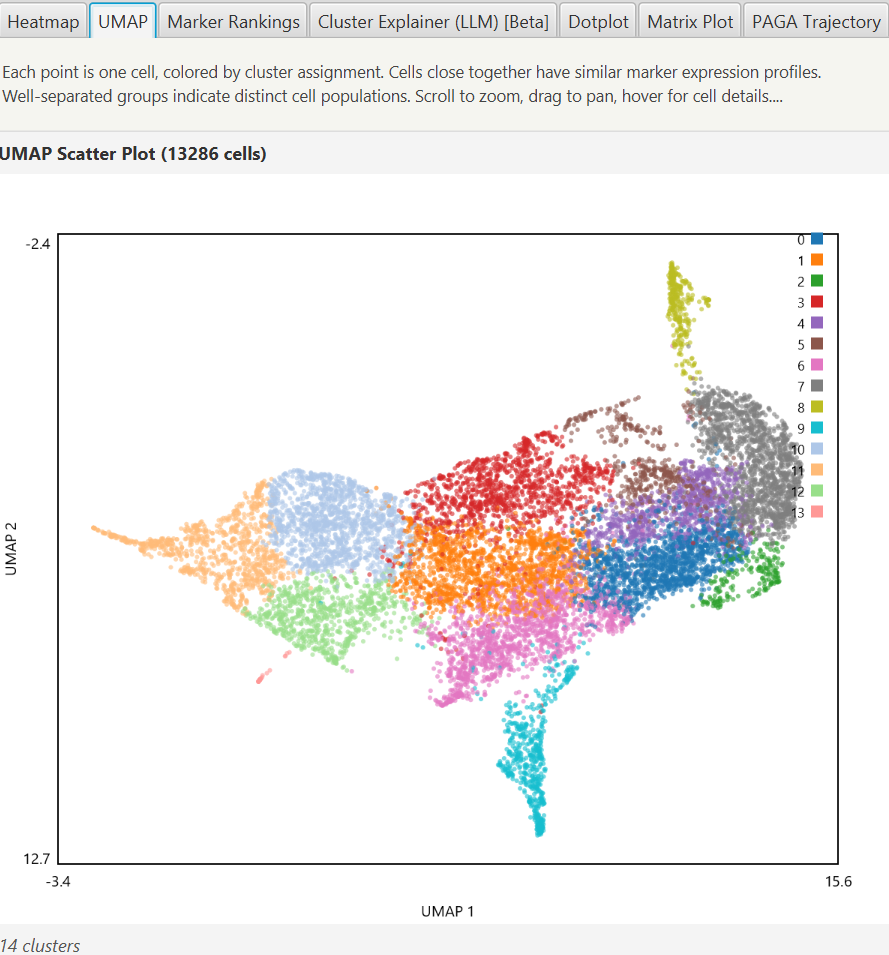
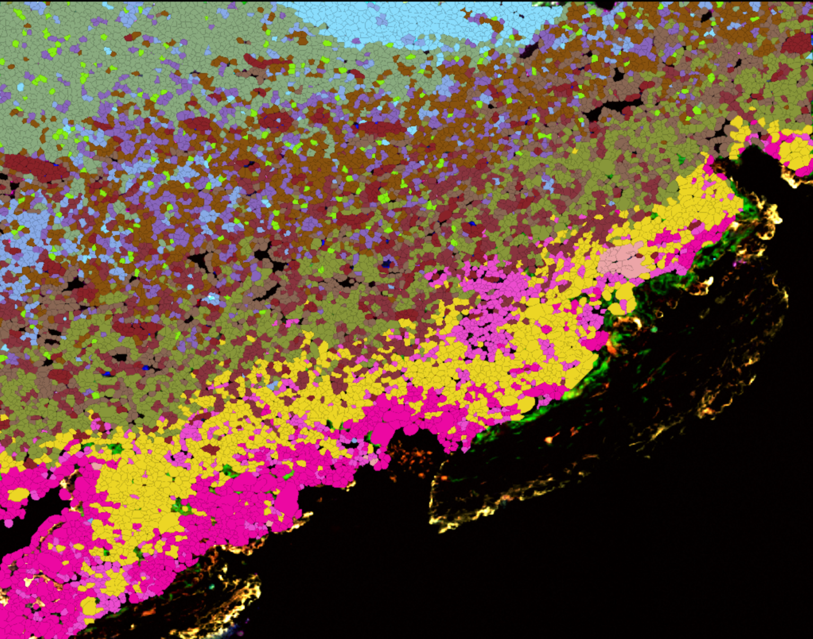

# QP-CAT: Cell Analysis Tools for QuPath

Python-powered cell analysis for highly multiplexed imaging data in [QuPath](https://qupath.github.io/).

Warning: This is a continuation of my work integrating other people's software into Qupath, like with Caleb's [CytoMap](https://forum.image.sc/t/there-and-back-again-qupath-cytomap-cluster-analysis/43352) and Alan's [QuBaLab](https://github.com/saramcardle/FS2K/blob/main/Clustering%20using%20Python.ipynb), attempting to make clustering and analysis more accessible on the QuPath side, but many of the features are lightly tested or entirely untested! 

QP-CAT embeds a full scientific Python environment (via [Appose](https://github.com/apposed/appose)) directly within QuPath -- no external servers, no conda environments to manage manually, no command-line tools. It provides unsupervised clustering, rule-based and zero-shot phenotyping, autoencoder-based cell classification, foundation model feature extraction, dimensionality reduction, spatial analysis, and interoperability export, all accessible through a GUI.


**Repository:** [uw-loci/qupath-extension-cell-analysis-tools](https://github.com/uw-loci/qupath-extension-cell-analysis-tools)

### Documentation

- **[How-To Guide](documentation/HOW_TO_GUIDE.md)** -- Step-by-step instructions for every workflow
- **[Best Practices](documentation/BEST_PRACTICES.md)** -- Recommendations for measurement selection, normalization, algorithm choice, and phenotyping strategy
- **[Scripting (Groovy)](documentation/SCRIPTING.md)** -- programmatic API for the spatial graph, spatial statistics, batch figure export, and the YAML headless-batch runner, callable from QuPath workflow scripts
- **[YAML Schema](documentation/YAML_SCHEMA.md)** -- field-by-field reference for the YAML headless-batch config file
- **[Troubleshooting -- LLM Cluster Explainer](documentation/TROUBLESHOOTING_LLM_EXPLAINER.md)** -- error states for the Cluster Explainer (LLM) [Beta] tab with what-you-see / what-it-means / what-to-do for every case
- **[Troubleshooting -- YAML Headless Batch](documentation/TROUBLESHOOTING_YAML_BATCH.md)** -- error-by-error remediation for the YAML batch runner, keyed by `E0xx` validation codes
- **[References](documentation/REFERENCES.md)** -- Original papers and DOI links for every algorithm and tool used in this extension

---

## Features

Each bullet leads with what you can *do* with QP-CAT; the algorithm name is in parentheses for when you need to know what's under the hood.

- **No-setup install** -- one click downloads and configures the full Python environment for you. No conda, no command line, no environment fights. ~1.5-2.5 GB download, ~2.5 GB on disk
- **Discover cell types without labels** -- automatic grouping of cells by their marker expression. Pick the algorithm that fits your question: Leiden or KMeans for first-pass discovery, HDBSCAN when you expect rare populations or noise, BANKSY when tissue architecture matters; plus Agglomerative, MiniBatch KMeans, and Gaussian Mixture for special cases
- **Phenotype with plain-English prompts** -- type "exhausted T cell" or "tumor-associated macrophage" and the model labels matching cells, no training required (zero-shot via [BiomedCLIP](https://huggingface.co/microsoft/BiomedCLIP-PubMedBERT_256-vit_base_patch16_224), MIT License, Microsoft)
- **Get a phenotype suggestion for each cluster, in plain English** [Beta] -- after clustering, push one button and the model reads each cluster's top markers, then proposes a cell-type label and a short rationale citing the markers it relied on. Useful when the panel is unfamiliar, when reviewing a student's clusters, or when writing up results. Bring your own key for Anthropic Claude, or point at a local Ollama endpoint for no-API-spend / offline use; the prompt and response are saved to the project audit log every time (LLM cluster explainer; Anthropic + Ollama providers)
- **Annotate a few cells, classify the rest** *(test feature)* -- label a small subset of cells in QuPath and a variational autoencoder (VAE) extends those labels to every cell in the project. Learns from your marker measurements, from the actual image patch around each cell (optionally with a CellSighter-style cell-mask channel so the network knows which cell is "the" cell), or both combined
- **Cluster on what cells look like, not just what markers say** -- pretrained vision models turn each tile into a numerical fingerprint of its morphology, so clusters can be driven by tissue appearance in addition to marker intensities. Useful when staining is variable, channels are limited, or morphology carries information your markers miss (H-optimus-0, Virchow, Hibou-B/L, Midnight, DINOv2-Large via [LazySlide](https://doi.org/10.1038/s41592-026-03044-7))
- **Cleaner clusters via tissue context** -- optional pre-step that averages each cell's features with its spatial neighbors before clustering, so niches and tissue zones come out as connected regions instead of salt-and-pepper noise. Turns any of the algorithms above into a spatially-aware version (graph convolution smoothing)
- **Marker gating with auto-thresholds** -- classic flow-cytometry-style cell typing, with sensible threshold suggestions per marker (Triangle, GMM, and Gamma auto-threshold methods)
- **Click the plot, see the cells** -- interactive UMAP / PCA / t-SNE: brush a region of the embedding and the corresponding cells highlight on the slide
- **Test where cell types live in tissue** -- ask whether two phenotypes co-localize or avoid each other, whether a marker is spatially structured at short range or long range, and how often two cell types meet at a given distance. Choose the graph behind the analysis explicitly (kNN, Radius, or Delaunay) so the same neighborhood backs every stat (neighborhood enrichment, Ripley's K/L, Geary's C, Moran's I, pairwise + one-vs-rest co-occurrence via squidpy; matches OpenIMC's spatial-stats catalog while reusing the squidpy backend QP-CAT already ships)
- **Compare across slides and batches** -- batch correction so your clusters reflect biology, not slide-of-origin or staining-day effects, when you analyze a multi-image project all at once (Harmony integration)
- **Publication-ready follow-up** -- find the markers that define each cluster (Wilcoxon ranking) and generate dotplots, violin plots, and PAGA trajectory graphs without leaving QuPath
- **Easy hand-off to Python / R** -- export results as standard `.h5ad` AnnData files. Compatible with Scanpy, Seurat, and cellxgene, so you can keep going in your usual notebook when you want to
- **Export every figure from a clustering run in one click** -- pick the project images you want, pick which plots you need (dotplot, matrix plot, PAGA, violin, scanpy embedding, neighborhood enrichment, spatial scatter, Ripley K/L, Geary's C, co-occurrence, ...), and write the lot to a directory at 300 DPI by default. PNG and TIFF in v1 (SVG / PDF / EPS arrive in v1.1). Image subsetting is mandatory, not just an "all / current" toggle. Callable from a Groovy script for batch / headless use (inspired by [OpenIMC](https://github.com/dean-tessone/OpenIMC)'s batch-export action)
- **Run QP-CAT in batch mode from a single YAML config, no GUI required** -- write the clustering / phenotyping / spatial-stats / figure-export plan in one file, then run it across every image in a project from a terminal via QuPath's `script` subcommand. Same surface the dialog uses (Appose env, audit log, saved results); reproducible, version-controllable, and CI-friendly. Inspired by [OpenIMC](https://github.com/dean-tessone/OpenIMC)'s `openimc workflow <config.yaml>` command; QP-CAT's variant runs inside QuPath's extension class loader so the analysis surface is identical to the dialog (YAML schema in [documentation/YAML_SCHEMA.md](documentation/YAML_SCHEMA.md), entry point `qpcat_batch.groovy`)
- **Reproducible audit trail** -- every operation is logged per-project with the full parameters used, so you (or a reviewer) can retrace exactly what was run, when, and how

---

## Requirements

- **QuPath** 0.6.0 or later
- **Java** 21+
- **Internet connection** for initial environment setup (~1.5-2.5 GB download)
- **Disk space** ~2.5 GB for the Python environment
- No GPU required -- all operations run on CPU (foundation model extraction benefits from GPU but works on CPU)
- **HuggingFace account** (optional) -- required only for gated models (H-optimus-0, Virchow, Hibou); set your auth token in the dialog
- **LLM provider account or local Ollama** (optional) -- required only for the *Cluster Explainer (LLM) [Beta]* feature. Choose one of: (a) an Anthropic API key from [console.anthropic.com](https://console.anthropic.com/), entered in the Cluster Explainer tab each session (held in memory only -- never written to disk); (b) a running [Ollama](https://ollama.com/) instance reachable from your machine (default `http://localhost:11434`). OpenAI is not supported in v1.

---

## Installation

### From GitHub Releases

1. Download the latest `.jar` from the [Releases](https://github.com/uw-loci/qupath-extension-cell-analysis-tools/releases) page
2. Drag the JAR onto the QuPath window, or place it in your QuPath extensions directory
3. Restart QuPath
4. Go to **Extensions > QP-CAT > Setup Clustering Environment** and click "Setup"
5. Wait for the Python environment to build (first time only, ~5-10 minutes)

### Building from Source

```bash
git clone https://github.com/uw-loci/qupath-extension-cell-analysis-tools.git
cd qupath-extension-cell-analysis-tools
./gradlew build
```

The built JAR will be in `build/libs/`. Copy it to your QuPath extensions directory.

---

## Quick Start

1. Open an image in QuPath with cell detections (run cell detection first if needed)
2. **Extensions > QP-CAT > Run Clustering...**
3. Select measurements (defaults to "Mean" intensity channels)
4. Choose algorithm (Leiden recommended) and click **Run Clustering**
5. Results are applied directly to detections as classifications (Cluster 0, Cluster 1, ...)
6. View interactive heatmaps, scatter plots, and marker rankings in the results dialog

For even faster exploration, use **Quick Cluster** submenu items which run with sensible defaults.

---

<details>
<summary><h2>Clustering</h2></summary>

### Supported Algorithms

| Algorithm | Type | Auto-detects k? | Notes |
|-----------|------|:---:|-------|
| **Leiden** | Graph-based | Yes | Recommended default. Resolution parameter controls granularity. |
| **KMeans** | Centroid-based | No | Requires specifying number of clusters. |
| **HDBSCAN** | Density-based | Yes | Also identifies noise/outlier cells. |
| **Agglomerative** | Hierarchical | No | Supports ward, complete, average, and single linkage. |
| **MiniBatch KMeans** | Centroid-based | No | Scalable variant of KMeans for very large datasets. |
| **GMM** | Probabilistic | No | Gaussian mixture model with soft cluster assignment. |
| **BANKSY** | Spatially-aware | Yes | Uses both expression and spatial coordinates. See [Spatial Clustering](#banksy-spatial-clustering). |

### Normalization Methods

| Method | Description | When to use |
|--------|-------------|-------------|
| **Z-score** | Zero mean, unit variance per marker | Recommended default for most analyses |
| **Min-Max** | Scale each marker to [0, 1] | When relative intensities matter |
| **Percentile** | Robust min-max using 1st/99th percentiles | When outliers are present |
| **None** | Raw measurement values | Pre-normalized data |

### Dimensionality Reduction

UMAP, PCA, and t-SNE embeddings are computed alongside clustering and added as measurements (e.g., `UMAP1`, `UMAP2`) to each detection. These can be used for visualization in QuPath or downstream tools.

The **Compute Embedding Only** dialog allows computing embeddings without clustering, preserving existing classifications.

### Multi-Image Project Clustering

Select "All project images" scope in the clustering dialog to cluster detections across your entire project simultaneously. This ensures globally consistent cluster assignments. Optionally enable **Harmony batch correction** to remove per-image technical variation before clustering.

### Batch correction (Harmony)

QP-CAT integrates [harmonypy](https://github.com/slowkow/harmonypy) (the Python port of [Harmony](https://github.com/immunogenomics/harmony), Korsunsky et al. 2019, *Nature Methods*) to remove per-image technical variation before clustering. This is essential for multi-image / multi-batch projects where each slide carries its own staining intensity profile.

**When the checkbox is enabled in the Clustering dialog:**

- Scope is set to "All project images" (single-image mode has no batches to correct), AND
- The harmonypy package was successfully imported when the QP-CAT Python environment started.

**When the checkbox is grayed out:**

- "All project images" is not selected -> single-image clustering does not need batch correction.
- harmonypy failed to install in the Python environment -> the tooltip on the disabled checkbox links you here.

**Platform support matrix:**

| Platform | Harmony version installed | Status |
|---|---|---|
| Linux x86_64 | harmonypy 0.2.0 (pure Python) | Supported |
| macOS (Intel + Apple Silicon) | harmonypy 0.2.0 (pure Python) | Supported |
| Windows x86_64 | harmonypy 0.2.0 (pure Python) | Supported |

QP-CAT pins `harmonypy >= 0.2.0, < 2`. Version 2.0.0+ is a pybind11/CMake build with no Windows wheel, which would force users to install MSVC Build Tools to use this feature. The 0.2.x series is the latest pure-Python release with the same `run_harmony()` API.

**If the checkbox is unexpectedly grayed out:**

1. Open the QP-CAT Python log (Extensions > QP-CAT > System Info, or check the QuPath log).
2. Look for the line `harmonypy: <version>` -- if you instead see `harmonypy: NOT INSTALLED`, the env build skipped or failed for this package.
3. **Use Extensions > QP-CAT > Utilities > Rebuild Clustering Environment** to delete and re-create the pixi env from a clean slate. This re-resolves the harmonypy pin and should produce a working install.
4. If rebuild still fails, file a bug report with the full QuPath log attached.

</details>

---

<details>
<summary><h2>Phenotyping</h2></summary>

Rule-based cell type classification using marker gating thresholds.

### Workflow

1. **Extensions > QP-CAT > Run Phenotyping...**
2. Select markers to use as gating channels
3. Set per-marker gate thresholds (manually or via auto-thresholding)
4. Define phenotype rules: each rule maps a cell type name to marker conditions (positive/negative)
5. Rules are evaluated in order (first match wins); unmatched cells are labeled "Unknown"

### Auto-Thresholding

Click **Compute Thresholds** to calculate suggested gate values for each marker using three methods:

| Method | Algorithm | Best for |
|--------|-----------|----------|
| **Triangle** | Geometric method from histogram shape | Skewed distributions with dominant negative peak |
| **GMM** | 2-component Gaussian mixture model | Bimodal distributions |
| **Gamma** | Gamma distribution fit (GammaGateR-inspired) | Right-skewed, strictly positive marker data |

Select a marker column header to view its histogram with an interactive draggable threshold line.

### Saving and Loading Rule Sets

Phenotype rules, gates, and marker selections can be saved to and loaded from the QuPath project directory (`<project>/qpcat/phenotype_rules/`). This allows reuse across sessions and sharing between team members.

</details>

---

<details>
<summary><h2>Spatial Analysis</h2></summary>

When enabled in the clustering dialog, QP-CAT computes spatial statistics over cell centroid coordinates. v1 covers the catalog OpenIMC ships (Ripley K/L, Geary's C, neighborhood enrichment, co-occurrence) on top of squidpy, with one explicit graph constructor driving every analysis so the parameters are visible and the same neighborhood backs every result.

### Available statistics

- **Neighborhood enrichment** -- Z-score matrix showing which clusters tend to co-localize (or avoid each other) in tissue space
- **Ripley's K** and **Ripley's L** -- cumulative distance distribution of cluster A around cluster B (or any cluster around itself), tested against a Poisson null. L is the variance-stabilised transform of K; most users read L
- **Geary's C** -- per-marker spatial autocorrelation. Sensitive to short-range / local patterns; complements Moran's I which weights long-range structure more heavily
- **Moran's I autocorrelation** -- per-marker spatial autocorrelation (already in QP-CAT v0)
- **Co-occurrence** (pairwise + one-vs-rest) -- how often cluster A is found within distance r of cluster B across a range of r. Pairwise gives every cluster against every other cluster; one-vs-rest collapses "all other clusters" into a single comparison

Results live in their own tabs in the clustering results dialog and are persisted to `SavedClusteringResult` so reopening past results re-renders the same charts and tables. Programmatic access via the `qupath.ext.qpcat.scripting` package -- see [SCRIPTING.md](documentation/SCRIPTING.md) for the Groovy API.

### Graph constructor (kNN / Radius / Delaunay)

Spatial statistics need a definition of "neighbor". In v1 the clustering dialog exposes this explicitly:

- **kNN** (default) -- each cell is connected to its k nearest neighbors by centroid distance. Default k = 15. Recommended starting point.
- **Radius** -- each cell is connected to every neighbor within a fixed radius (in pixel units of the detection centroids). Use when the biology has a natural distance scale (e.g. immune synapse distance ~ 20 microns).
- **Delaunay** -- a triangulation that connects each cell to its geometric neighbors; no k or radius. Optional max-edge pruning drops over-long edges (use for tissue with large gaps).

The same graph backs **spatial feature smoothing** (the pre-clustering step) and **all post-clustering spatial stats** when you opt in via Preferences. The shared graph parameters are visible in the dialog and recorded in the audit log on every run.

**BANKSY is independent.** When BANKSY is selected as the clustering algorithm, it keeps its own internal pybanksy neighbor model (the `k_geom` spinner). BANKSY's graph is not surfaced as the kNN/Radius/Delaunay constructor in v1 because pybanksy does not expose a "bring your own graph" hook. This is by design and documented in the dialog.

QP-CAT's v1 statistic surface matches [OpenIMC](https://github.com/dean-tessone/OpenIMC)'s spatial-stats catalog (Ripley + Geary + co-occurrence + neighborhood enrichment) while keeping the squidpy backend the extension already ships with -- no new dependencies.

### Permutation tests

Ripley K/L, Geary's C, and co-occurrence support permutation-based significance testing. QP-CAT picks the number of permutations **adaptively** by default:

| Cell count | Permutations |
|---|---|
| <= 50k | 1000 |
| 50k - 500k | 100 |
| > 500k | 50 |

The chosen value shows next to the result and is recorded in the audit log. Override via the `qpcat.spatial.permutations` preference (set to a positive integer to force; leave at 0 for adaptive).

### BANKSY Spatial Clustering

[BANKSY](https://github.com/prabhakarlab/Banksy_py) integrates spatial neighborhood information directly into the clustering algorithm. It augments each cell's expression profile with a weighted average of its spatial neighbors' expression, then clusters on the combined representation.

Parameters:
- **lambda** (0-1): Weight of spatial vs. expression information (0.2 is a good starting point)
- **k_geom**: Number of spatial nearest neighbors
- **resolution**: Leiden resolution for the final clustering step

### Spatial Feature Smoothing

Spatial feature smoothing is a graph convolution pre-step that can be enabled for **any** clustering algorithm. When enabled, each cell's features are smoothed with its spatial neighbors before clustering, encouraging nearby cells to receive similar cluster assignments.

How it works:
1. A k-nearest neighbor graph is built from cell centroid coordinates
2. The adjacency matrix is row-normalized so each cell's neighbors contribute equally
3. Each cell's feature vector is replaced by a weighted average of itself and its neighbors
4. The smoothed features are then passed to the selected clustering algorithm

Enable the **"Spatial feature smoothing"** checkbox in the clustering dialog. The parameter **k** controls the number of spatial nearest neighbors (default 15).

This is a lighter-weight alternative to BANKSY when you want spatial awareness without switching to a fully spatial algorithm.

</details>

---

<details>
<summary><h2>Foundation Model Feature Extraction</h2></summary>

**Extensions > QP-CAT > Extract Foundation Model Features...** extracts tile-level morphological embeddings from pre-trained vision foundation models and stores them as per-detection measurements (`FM_0`, `FM_1`, ..., `FM_N`).

### Supported Models

| Model | Developer | License | Embedding Dim | Gated? |
|-------|-----------|---------|:---:|:---:|
| **H-optimus-0** | Bioptimus | Apache 2.0 | 1536 | Yes |
| **Virchow** | Paige AI | Apache 2.0 | 2560 | Yes |
| **Hibou-B** | HistAI | Apache 2.0 | 768 | Yes |
| **Hibou-L** | HistAI | Apache 2.0 | 1024 | Yes |
| **Midnight** | kaiko.ai | Apache 2.0 | 768 | No |
| **DINOv2-Large** | Meta AI | Apache 2.0 | 1024 | No |

All models are downloaded on-demand from HuggingFace and cached locally -- they are not bundled with the extension. Only models with commercially permissive licenses (Apache 2.0) are included.

**Gated models** (H-optimus-0, Virchow, Hibou) require a HuggingFace account and auth token. Accept the model's license on its HuggingFace page, then enter your token in the extraction dialog.

Foundation model features capture rich morphological information from the image tile surrounding each cell. They can be used as input measurements for clustering (instead of or alongside channel intensity measurements), enabling morphology-driven cell grouping.

Feature extraction is powered by [LazySlide](https://doi.org/10.1038/s41592-026-03044-7).

</details>

---

<details>
<summary><h2>Zero-Shot Phenotyping</h2></summary>

**Extensions > QP-CAT > Zero-Shot Phenotyping (BiomedCLIP)...** assigns cell phenotypes using natural language text prompts -- no marker gating rules or training data required.

### How It Works

1. Image tiles are extracted around each cell detection
2. [BiomedCLIP](https://huggingface.co/microsoft/BiomedCLIP-PubMedBERT_256-vit_base_patch16_224) (MIT License, Microsoft) computes vision-language similarity between each tile and your text prompts
3. Each cell is assigned the phenotype whose text prompt best matches its image tile
4. A confidence score is stored alongside each assignment

### Usage

1. Open the dialog and enter phenotype text prompts, one per line (e.g., "lymphocyte", "tumor cell", "stromal cell", "macrophage")
2. Click **Run**
3. Each detection receives a classification matching the highest-scoring prompt

BiomedCLIP is downloaded on-demand from HuggingFace and cached locally. It does not require a HuggingFace auth token.

</details>

---

<details>
<summary><h2>Cluster Explainer (LLM) [Beta]</h2></summary>

**Cluster results dialog > Cluster Explainer (LLM) [Beta] tab** turns each cluster's top-marker statistics into a plain-English phenotype suggestion with rationale. The LLM reads only the per-cluster marker rankings and cluster summary statistics -- no pixels, no cell-level data, no patient-identifiable information.

This feature is marked **[Beta]** for v1: the surface area (prompt template, output JSON, audit-log row shape) may change in v1.1 based on user feedback. The audit log is the canonical record of every call. Both Java and Python sides scrub `Authorization:` headers and `sk-ant-*` keys before any payload reaches the log.

Inspired by [OpenIMC](https://github.com/dean-tessone/OpenIMC)'s LLM phenotyping; QP-CAT's variant uses Anthropic + Ollama (not OpenAI), reads marker statistics only (no pixels, no patient metadata), and writes a full prompt+response audit log on every call. See `documentation/HOW_TO_GUIDE.md` Section 10 for the workflow.

### Providers

| Provider | Pros | Cons | Default model |
|---|---|---|---|
| **Anthropic Claude** | Strong reasoning, structured output via tool-use, hosted | Costs money per call; key must be re-entered each session | `claude-sonnet-4-5` (also `claude-opus-4-7`) |
| **Ollama (local)** | Free, offline, no key needed, no data leaves your machine | Quality varies with chosen model; must run an Ollama server | `llama3.1:8b` (or any model you have pulled) |

OpenAI is intentionally **not** supported in v1.

### How It Works

1. After clustering completes (or after "View Past Results"), open the **Cluster Explainer (LLM) [Beta]** tab in the results dialog
2. Pick a provider and model directly in the tab, and -- for Anthropic -- paste your API key
3. Click **Run Explainer**. One LLM call is made with all clusters' Wilcoxon marker rankings + cell counts as input
4. Results render as a per-cluster table: suggested phenotype, confidence band, top supporting markers, one-paragraph rationale
5. The full prompt and full response are written to the project audit log at `<project>/qpcat/logs/qpcat_YYYY-MM-DD.log` under the `=== LLM EXPLAIN ===` entry tag

### What the LLM Sees

The LLM input is constructed from `ClusteringResult.markerRankingsJson` plus per-cluster cell counts and the cluster-by-marker mean expression table. Concretely, for each cluster:

- Cluster id and cell count
- Top-N (default 10) markers by Wilcoxon score, with score, log fold change, and adjusted p-value
- Mean expression of those markers in this cluster vs. other clusters

It does **not** see pixels, individual cell measurements, image metadata, patient identifiers, file paths, or anything from the QuPath project beyond the per-cluster statistics described above.

### BYO Key Handling

The API key is entered in a TextField on the explainer tab. It is held in memory only for the lifetime of the QuPath session and is never written to disk, never logged, and never serialized into `SavedClusteringResult`. For headless / power-user setups, the key can be supplied via the `QPCAT_ANTHROPIC_KEY` environment variable instead; if set, the TextField is pre-populated as masked text and can be left empty.

See [How-To Guide section 10](documentation/HOW_TO_GUIDE.md#10-explaining-clusters-with-an-llm-beta) for the full workflow and [Best Practices](documentation/BEST_PRACTICES.md#when-to-use-the-llm-cluster-explainer) for guidance on when to trust the output.

</details>

---

<details>
<summary><h2>[TEST] Autoencoder Cell Classifier</h2></summary>

**Extensions > QP-CAT > [TEST] Autoencoder Classifier...** trains a variational autoencoder (VAE) with a semi-supervised classifier head on cell measurements. This is a **test feature** under active development.

### How It Works

1. Label cells using one or more methods:
   - **Locked annotations** (default ON): draw region, assign class, lock it -- all detections inside inherit the class
   - **Point annotations** (default ON): use Points tool with a class to click on individual cells
   - **Detection classifications** (default OFF): use existing PathClass labels on detections
2. Select one or more project images for training (multi-image for better generalization)
3. The VAE learns a compressed latent representation from all cells
4. A classifier head trained on the labeled subset propagates labels to all cells
5. The trained model can be applied across all images in a project

### Architecture

- **Encoder**: Measurements -> 128 -> 64 -> latent space (configurable dim, default 16)
- **Decoder**: Latent space -> 64 -> 128 -> reconstructed measurements (Gaussian likelihood)
- **Classifier**: Latent space -> class probabilities (semi-supervised)

Follows the scANVI pattern (Xu et al. 2021) adapted for continuous protein measurements.

### Training Modes

- **Semi-supervised** (recommended): Some cells labeled, rest unlabeled. Reconstruction shapes the latent space; labels guide it.
- **Fully supervised**: All cells labeled. Classification drives latent structure.
- **Unsupervised**: No labels. VAE learns reconstruction only (set supervision weight to 0).

### Output

- `AE_0` through `AE_N` measurements: latent features per cell
- `AE_confidence`: classifier confidence score
- PathClass labels: predicted cell type
- Trained model can be applied to other images via "Apply to All Project Images"

### Input Modes

- **Measurements** (default): Uses per-cell measurement values (e.g., mean channel intensities). MLP encoder/decoder. Fast (seconds to minutes on CPU). No GPU required.
- **Tile images**: Uses multi-channel pixel tiles centered on each cell. Convolutional encoder/decoder. Captures spatial morphology and texture that measurements miss. All image channels included automatically. Optionally appends a binary cell mask channel (CellSighter approach, Amitay et al. 2023, Nature Communications). Benefits from GPU; CPU is slower.
- **Hybrid (Tile + Measurements)**: In tile mode, selected measurements can be included as a secondary input alongside pixel tiles. The model uses a Hybrid ConvVAE architecture where convolutional features from the image tile are concatenated with measurement values before the latent space. This combines spatial/morphological information from pixels with quantitative features like Solidity, Area, Circularity, or channel intensities. Select measurements in the measurement panel even when tile mode is active to enable hybrid input.

### Cell Mask Channel (Tile Mode)

When "Include cell mask channel" is checked (default ON), a binary mask of the target cell's ROI is appended as an extra channel. The mask acts as an attention guide:

- 1.0 inside the cell boundary, 0.0 outside
- Neighboring cell pixels are NOT zeroed out -- their context is informative
- The network learns which cell to classify while using spatial context from neighbors
- Based on CellSighter (Amitay et al. 2023) which showed neighbor spillover patterns help classification in multiplexed imaging

For additional discriminative power, morphology measurements such as Solidity, Area, and Circularity can be combined with tile input via the hybrid mode (see [Input Modes](#input-modes)).

### Performance Considerations

| Mode | Dataset Size | Approx. Training Time (CPU) | GPU Benefit |
|------|-------------|----------------------------|-------------|
| Measurements | 1,000 cells | ~30 seconds | Minimal |
| Measurements | 10,000 cells | ~3 minutes | Minimal |
| Measurements | 50,000 cells | ~15 minutes | Moderate |
| Tile images 32x32 | 1,000 cells | ~2-5 minutes | Significant |
| Tile images 32x32 | 10,000 cells | ~20-60 minutes | Significant |
| Tile images 64x64 | 10,000 cells | ~1-3 hours | Required |

Tile mode is substantially slower than measurement mode because the convolutional network processes spatial pixel data. For large datasets or tile sizes above 32x32, GPU is strongly recommended.

Inference (applying a trained model) is much faster than training -- typically seconds per image regardless of mode.

### Training Features

VAE best practices and training infrastructure:

| Feature | Description | Default |
|---------|-------------|---------|
| **Gaussian NLL** | Learned per-feature variance for heteroscedastic noise (measurement mode) | ON |
| **Cyclical KL annealing** | 4-cycle ramp prevents posterior collapse (Fu et al. 2019) | beta_max=0.5 |
| **Free bits** | Min KL per latent dim prevents dimension collapse (Kingma et al. 2016) | 0.25 nats |
| **LayerNorm** | Per-sample normalization (preferred over BatchNorm for VAEs) | ON |
| **Logvar clamping** | Numerical stability for variance outputs | [-10, 10] |
| **Unsupervised pre-training** | Train reconstruction before classification | 10% of epochs |
| **Label-fraction scaling** | Classification weight scaled by N_total/N_labeled | Auto |
| **Active units monitoring** | Warns on posterior collapse (low active latent dims) | Auto |
| **R-squared diagnostics** | Per-feature reconstruction quality check | Auto |
| **Class weighting** | Inverse-frequency weights for imbalanced populations | ON |
| **Per-class weight spinners** | Manual per-class weight adjustment via individual spinners in the dialog | 1.0 each |
| **Auto-Balance** | Button that computes inverse-frequency weights and populates per-class spinners automatically | -- |
| **Validation split** | Stratified holdout set for monitoring overfitting | 20% |
| **Early stopping** | Stop when val accuracy plateaus; restore best model | Patience=15 |
| **ReduceLROnPlateau** | Halve LR when loss plateaus (standard VAE scheduler) | factor=0.5 |
| **Mixed precision** | FP16 on CUDA for ~2x speedup | Auto (CUDA only) |
| **Gradient clipping** | Prevents exploding gradients | max_norm=1.0 |
| **Adam optimizer** | No weight decay (conflicts with KL regularization) | lr=0.001 |
| **Data augmentation** | Noise + scaling + feature dropout (measurement mode) | ON |

### Current Limitations (Test Feature)

- No data augmentation for tile mode yet (spatial transforms planned)
- Fixed encoder architecture (3-layer conv or 2-layer MLP); no architecture tuning
- Training loss displayed in log only, no live chart
- Tile mode with many channels (40+) and large tiles (64x64) can exhaust GPU memory
- Results should be validated before use in published analyses

</details>

---

<details>
<summary><h2>Post-Analysis Outputs</h2></summary>

After clustering, QP-CAT can generate:

| Output | Description |
|--------|-------------|
| **Interactive heatmap** | Cluster-by-marker mean expression with click-to-select |
| **Interactive scatter** | UMAP/PCA/t-SNE plot colored by cluster, zoomable and pannable |
| **Marker rankings** | Top differentially expressed markers per cluster (Wilcoxon rank-sum test) |
| **PAGA graph** | Cluster connectivity/trajectory graph |
| **Dotplot** | Fraction expressing + mean expression per cluster per marker |
| **Stacked violin** | Expression distributions per cluster |
| **Spatial scatter** | Cell positions colored by cluster (when spatial analysis enabled) |





</details>

---

<details>
<summary><h2>Data Export</h2></summary>

### AnnData (.h5ad)

Export your data to the AnnData format for use with external tools:

- **Extensions > QP-CAT > Export AnnData (.h5ad)...**

The exported file includes:
- All selected measurements as the expression matrix
- Cluster assignments (if present)
- Phenotype labels (if present)
- Embedding coordinates (UMAP/PCA/t-SNE if computed)
- Spatial coordinates (cell centroids)

Compatible with Scanpy, Seurat (via SeuratDisk), cellxgene, and other single-cell analysis tools.

</details>

---

<details>
<summary><h2>Cluster Management</h2></summary>

**Extensions > QP-CAT > Manage Clusters...** opens a dialog for post-hoc cluster organization:

- **Rename** -- Change a cluster's classification name (e.g., "Cluster 3" -> "CD8+ T Cells")
- **Merge** -- Combine two or more clusters into one with a user-specified name

Changes are applied directly to detection objects and reflected immediately in QuPath's viewer.

</details>

---

<details>
<summary><h2>Configuration Persistence</h2></summary>

### Clustering Configs

Save and load clustering parameter sets (algorithm, parameters, measurement selection, normalization, embedding settings) within a QuPath project. Stored in `<project>/qpcat/cluster_configs/`.

### Operation Audit Trail

Every operation (clustering, phenotyping, embedding, export, threshold computation) is logged with full parameters, timestamps, cell counts, and results to per-day log files at:

```
<project>/qpcat/logs/qpcat_YYYY-MM-DD.log
```

This provides a reproducibility trail -- you can always see exactly what parameters were used for any analysis. Log files are human-readable text.

</details>

---

<details>
<summary><h2>Python Console</h2></summary>

**Extensions > QP-CAT > Utilities > Python Console** opens a window showing real-time Python stderr/debug output from the embedded Python environment. Useful for:

- Monitoring long-running operations
- Debugging Python-side errors
- Viewing detailed progress messages

The console includes a **Save Log...** button to export its contents to a text file.

</details>

---

<details>
<summary><h2>Python Environment</h2></summary>

QP-CAT manages its own isolated Python environment via [Appose](https://github.com/apposed/appose) and [pixi](https://pixi.sh/). The environment is stored at:

```
~/.local/share/appose/qupath-qpcat/    (Linux/macOS)
%LOCALAPPDATA%\appose\qupath-qpcat\    (Windows)
```

### Key Python Packages

| Package | Purpose |
|---------|---------|
| scanpy | Core single-cell analysis framework |
| scikit-learn | KMeans, HDBSCAN, GMM, Agglomerative clustering |
| leidenalg | Leiden community detection |
| umap-learn | UMAP dimensionality reduction |
| squidpy | Spatial analysis (neighborhood enrichment, Moran's I, Geary's C, Ripley K/L, co-occurrence) |
| harmonypy | Batch correction for multi-sample integration |
| pybanksy | Spatially-aware BANKSY clustering |
| anndata | AnnData format for interoperability |
| lazyslide | Foundation model feature extraction |
| open_clip | BiomedCLIP vision-language model for zero-shot phenotyping |
| torch | Deep learning runtime for foundation models and BiomedCLIP |
| scikit-image | Auto-thresholding (Triangle method) |
| scipy | Gamma distribution fitting for auto-thresholds |
| matplotlib | Plot generation |

### Rebuilding the Environment

If the environment becomes corrupted or you need to update packages:

1. **Extensions > QP-CAT > Utilities > Rebuild Clustering Environment**
2. Confirm the rebuild (this deletes the existing environment)
3. Click "Setup" in the dialog that appears

</details>

---

<details>
<summary><h2>Menu Reference</h2></summary>

All items are under **Extensions > QP-CAT**:

| Menu Item | Description | Requirements |
|-----------|-------------|--------------|
| Setup Clustering Environment | One-time Python environment installation | Internet connection |
| Run Clustering... | Full clustering dialog with all options | Image + detections |
| Compute Embedding Only... | UMAP/PCA/t-SNE without clustering | Image + detections |
| Extract Foundation Model Features... | Extract morphological embeddings from vision models | Image + detections |
| Zero-Shot Phenotyping (BiomedCLIP)... | Text-prompt cell phenotyping via vision-language model | Image + detections |
| [TEST] Autoencoder Classifier... | Train VAE classifier, apply across project | Image + detections + labels |
| Run Phenotyping... | Rule-based cell type classification | Image + detections + project |
| Quick Cluster > Quick Leiden | One-click Leiden clustering with defaults | Image + detections |
| Quick Cluster > Quick KMeans | One-click KMeans (k=10) | Image + detections |
| Quick Cluster > Quick HDBSCAN | One-click HDBSCAN with defaults | Image + detections |
| Manage Clusters... | Rename and merge cluster classifications | Image |
| Export AnnData (.h5ad)... | Export data for external analysis tools | Image + detections |
| Export Figures... | Multi-Figure Batch Export: pick images + plot kinds + format + DPI + output directory; writes saved matplotlib plots in one pass. See [HOW_TO_GUIDE chapter 18](documentation/HOW_TO_GUIDE.md#18-exporting-figures) | Project + at least one saved clustering result |
| Utilities > Python Console | View Python debug output | None |
| Utilities > System Info... | Show version and environment details | Environment ready |
| Utilities > Rebuild Environment | Delete and re-download Python environment | None |

</details>

---

<details>
<summary><h2>Troubleshooting</h2></summary>

### Environment setup fails

- Check your internet connection -- the initial download is ~1.5-2.5 GB
- Check available disk space (~2.5 GB required)
- Try **Rebuild Environment** to start fresh
- Check the Python Console for detailed error messages

### "No detections found"

QP-CAT operates on detection objects (cells). Run cell detection first:
- **Analyze > Cell detection** in QuPath, or
- Use StarDist, Cellpose, or another detection method

### Clustering produces unexpected results

- Try different normalization methods -- Z-score is recommended for most data
- Adjust algorithm parameters (e.g., Leiden resolution, HDBSCAN min_cluster_size)
- Check the marker selection -- "Mean" measurements are usually best for clustering
- View the interactive heatmap to assess cluster quality

### Memory issues with large datasets

- Use MiniBatch KMeans for datasets with >100,000 cells
- Reduce the number of selected measurements
- Consider clustering a subset (select detections within an annotation)

### Cluster Explainer (LLM) issues

The LLM explainer can fail in a handful of well-defined ways: network unreachable, invalid API key, rate limit, malformed response, Ollama endpoint down, Ollama model not pulled, request cancelled, or the **Run Explainer** button disabled because no provider is selected in the tab or the clustering result has no Wilcoxon marker rankings. Each error message includes a concrete next step.

See [`documentation/TROUBLESHOOTING_LLM_EXPLAINER.md`](documentation/TROUBLESHOOTING_LLM_EXPLAINER.md) for the full list with what-you-see / what-it-means / what-to-do for every case.

</details>

---

<details>
<summary><h2>Building from Source</h2></summary>

```bash
git clone https://github.com/uw-loci/qupath-extension-cell-analysis-tools.git
cd qupath-extension-cell-analysis-tools
./gradlew build
```

The extension JAR is output to `build/libs/`.

To compile only (no tests):
```bash
./gradlew compileJava
```

</details>

---

<details>
<summary><h2>Project Structure</h2></summary>

```
src/main/java/qupath/ext/qpcat/
  SetupQPCAT.java                 Extension entry point and menu registration
  controller/
    ClusteringWorkflow.java       Orchestrates all analysis operations
  model/
    ClusteringConfig.java         Configuration with enums for algorithms/normalization/embedding
    ClusteringResult.java         Result container with labels, stats, plots, spatial data
    PhenotypeRuleSet.java         Serializable phenotype rule definitions
  preferences/
    QpcatPreferences.java         Extension preferences and persistent settings
  service/
    ApposeClusteringService.java  Appose Python IPC singleton
    MeasurementExtractor.java     Extracts measurements from QuPath detections
    ResultApplier.java            Applies labels/embeddings back to detections
    OperationLogger.java          Per-project operation audit trail
    ClusteringConfigManager.java  Config save/load to project directory
    PhenotypeRuleSetManager.java  Rule set save/load to project directory
    ChannelValidator.java         Cross-image measurement consistency checking
  ui/
    AutoencoderDialog.java        Autoencoder classifier training and inference dialog
    ClusteringDialog.java         Main clustering configuration dialog
    ClusterHeatmapPanel.java      Interactive cluster-by-marker heatmap
    ClusterManagementDialog.java  Rename/merge cluster classifications
    EmbeddingDialog.java          Embedding-only computation dialog
    EmbeddingScatterPanel.java    Interactive 2D embedding scatter plot
    FeatureExtractionDialog.java  Foundation model feature extraction dialog
    HistogramPanel.java           Interactive histogram with draggable threshold
    PhenotypingDialog.java        Phenotyping rules and gating dialog
    PythonConsoleWindow.java      Real-time Python stderr viewer
    SetupEnvironmentDialog.java   Environment download progress dialog
    ZeroShotPhenotypingDialog.java  Zero-shot BiomedCLIP phenotyping dialog

src/main/resources/qupath/ext/qpcat/
  pixi.toml                       Python environment specification
  scripts/
    compute_thresholds.py         Auto-threshold computation
    export_anndata.py             AnnData export
    extract_features.py           Foundation model feature extraction
    infer_autoencoder.py          Autoencoder inference on new data
    init_services.py              Python worker initialization
    model_utils.py                Model save/load and architecture utilities
    run_clustering.py             Clustering pipeline
    run_phenotyping.py            Phenotyping pipeline
    system_info.py                Python environment info collection
    train_autoencoder.py          VAE autoencoder training pipeline
    zero_shot_phenotyping.py      BiomedCLIP zero-shot cell phenotyping
```

</details>

---

## Acknowledgments

Developed at the [Laboratory for Optical and Computational Instrumentation (LOCI)](https://eliceirilab.org/) at the University of Wisconsin-Madison.

**Key dependencies:**
- [QuPath](https://qupath.github.io/) -- Open-source bioimage analysis
- [Appose](https://github.com/apposed/appose) -- Inter-process communication for polyglot scientific computing
- [Scanpy](https://scanpy.readthedocs.io/) -- Single-cell analysis in Python
- [squidpy](https://squidpy.readthedocs.io/) -- Spatial single-cell analysis
- [BANKSY](https://github.com/prabhakarlab/Banksy_py) -- Spatially-aware clustering
- [Harmony](https://github.com/immunogenomics/harmony) -- Batch correction
- [LazySlide](https://github.com/rendeirolab/LazySlide) -- Foundation model feature extraction
- [BiomedCLIP](https://huggingface.co/microsoft/BiomedCLIP-PubMedBERT_256-vit_base_patch16_224) -- Zero-shot vision-language phenotyping (MIT License, Microsoft)

---

## Support

For general support and feature requests, please post on the [image.sc forum](https://forum.image.sc/) with the `#qupath` tag and mention `@Mike_Nelson` to flag the topic for my attention.

## License

[Apache License 2.0](LICENSE). QP-CAT is a QuPath plugin; when distributed together with
QuPath (GPL-3.0) the combined work is governed by the GPL. Third-party dependencies and
inspirations are recorded in [THIRD_PARTY_NOTICES.md](THIRD_PARTY_NOTICES.md).

## AI-Assisted Development

This project was developed with assistance from [Claude](https://claude.ai) (Anthropic). Claude was used as a development tool for code generation, architecture design, debugging, and documentation throughout the project.
