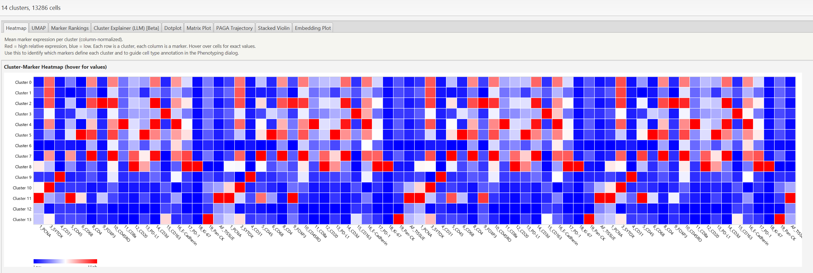
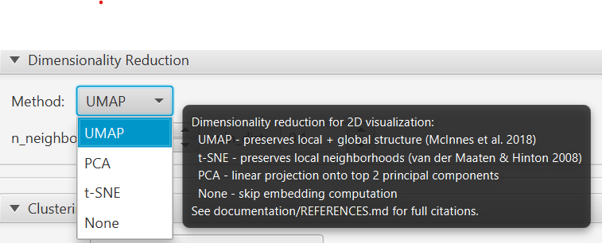
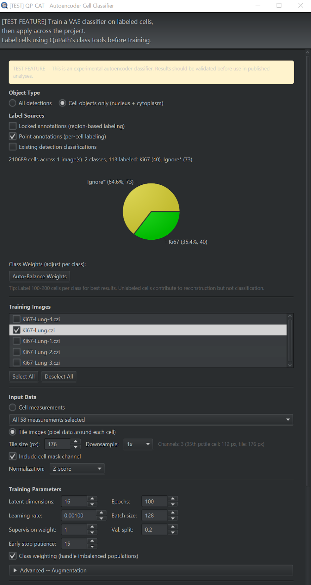

# QP-CAT -- How-To Guide

Step-by-step instructions for every workflow in the QP-CAT extension.

**Prerequisites for all workflows:**
- QuPath 0.6.0+ with QP-CAT installed
- Python environment set up (Extensions > QP-CAT > Setup Clustering Environment)
- An image open in QuPath with cell detections present

---

## Table of Contents

1. [Setting Up the Environment](#1-setting-up-the-environment)
2. [Running Clustering](#2-running-clustering)
3. [Quick Clustering](#3-quick-clustering)
4. [Multi-Image Project Clustering](#4-multi-image-project-clustering)
5. [Computing Embeddings Only](#5-computing-embeddings-only)
6. [Rule-Based Phenotyping](#6-rule-based-phenotyping)
7. [Using Auto-Thresholding](#7-using-auto-thresholding)
8. [Extracting Foundation Model Features](#8-extracting-foundation-model-features)
9. [Zero-Shot Phenotyping](#9-zero-shot-phenotyping)
10. [Explaining Clusters with an LLM (Beta)](#10-explaining-clusters-with-an-llm-beta)
11. [Managing Clusters (Rename/Merge)](#11-managing-clusters-renamemerge)
12. [Autoencoder Cell Classifier (TEST)](#12-test-autoencoder-cell-classifier)
13. [Exporting AnnData](#13-exporting-anndata)
14. [Saving and Loading Configurations](#14-saving-and-loading-configurations)
15. [Viewing the Python Console](#15-viewing-the-python-console)
16. [Reviewing the Operation Audit Trail](#16-reviewing-the-operation-audit-trail)
17. [Spatial Statistics (Ripley, Geary, Co-occurrence)](#17-spatial-statistics-ripley-geary-co-occurrence)
18. [Exporting Figures](#18-exporting-figures)
19. [YAML Headless Batch](#19-yaml-headless-batch)
20. [Results dialog reference](#20-results-dialog-reference)
21. [Spatial graph overlay](#21-spatial-graph-overlay)

---

## 1. Setting Up the Environment

**First-time only.** This downloads Python and all scientific packages (~1.5-2.5 GB).

1. Open QuPath
2. Go to **Extensions > QP-CAT > Setup Clustering Environment**
3. Click **Setup Environment**
4. Wait for the download and build to complete (5-10 minutes depending on internet speed)
5. When "Environment setup complete!" appears, close the dialog
6. The rest of the QP-CAT menu items now become visible

**Troubleshooting:** If setup fails, check your internet connection and disk space (~2.5 GB needed). Use **Utilities > Rebuild Clustering Environment** to start fresh.

**Windows file-lock during install** (`failed to link ... os error 32 ... being used by another process`): another process is holding a file open inside the env directory. QP-CAT v0.3.4+ detects this and logs the full PowerShell recovery script -- check the QuPath log. Short version: close QuPath fully (kill leftover `java.exe` / `python.exe` in Task Manager), delete `%USERPROFILE%\.local\share\appose\qupath-qpcat\.pixi` and `pixi.lock`, optionally add `%USERPROFILE%\.local\share\appose\` as an AV exclusion, then relaunch. Reboot Windows if step 3 fails -- that releases every file handle.

**Stale `pkg_resources` / `xarray_schema` import on launch** (separate failure mode, not file-lock): QP-CAT v0.3.2+ detects this automatically, wipes the env, and asks you to restart -- second launch rebuilds and clustering works again.

---

## 2. Running Clustering

Full clustering with all configuration options.

### Step-by-step:

1. Open an image with cell detections
2. **Extensions > QP-CAT > Run Clustering...**
3. **Scope** -- Choose "Current image" or "All project images"
4. **Measurements** -- Select the markers to cluster on
   - Click **Select 'Mean' only** for a good default (mean intensity per marker)
   - Or manually select specific measurements
5. **Normalization** -- Choose a scaling method
   - **Z-score** is recommended for most analyses
   - See [Best Practices](BEST_PRACTICES.md#normalization) for guidance
6. **Embedding** -- Choose dimensionality reduction
   - **UMAP** is recommended (preserves both local and global structure)
   - Adjust n_neighbors (2-200, default 15) and min_dist (0.0-1.0, default 0.1) if needed
7. **Algorithm** -- Choose a clustering method
   - **Leiden** is recommended for most use cases (auto-detects number of clusters)
   - Set algorithm-specific parameters (see [Parameter Reference](#algorithm-parameters) below)
8. **Analysis options** -- Check boxes as needed:
   - "Generate analysis plots" -- produces static PNGs (marker ranking, PAGA, dotplot)
   - "Spatial analysis" -- computes neighborhood enrichment and Moran's I
   - "Spatial feature smoothing" -- smooths features using spatial neighbors before clustering (see note below)
   - "Batch correction" -- applies Harmony (only for multi-image scope)
9. Click **Run Clustering**
10. View results in the results dialog (heatmap, scatter plot, marker rankings, plots)



### What happens to your data:

- Each detection gets a **PathClass** classification like "Cluster 0", "Cluster 1", etc.
- If embedding was computed, measurements **UMAP1/UMAP2** (or PCA1/PCA2, tSNE1/tSNE2) are added to each detection
- The QuPath viewer updates to show cluster colors on cells

### Spatial Feature Smoothing

When "Spatial feature smoothing" is checked, a graph convolution pre-step is applied before clustering:

1. A k-nearest neighbor graph is built from cell centroid coordinates
2. The adjacency matrix is row-normalized
3. Each cell's selected measurements are replaced by a weighted average of its spatial neighbors' values
4. The smoothed measurements are then passed to the chosen clustering algorithm

This makes **any** algorithm spatially-aware (not just BANKSY). Adjust the smoothing **k** parameter to control the spatial neighborhood size (default 15). Higher k = stronger smoothing across a larger neighborhood.

---

## 3. Quick Clustering

One-click clustering with sensible defaults. Good for initial exploration.

1. Open an image with cell detections
2. **Extensions > QP-CAT > Quick Cluster** and pick one:
   - **Quick Leiden (auto)** -- Leiden with n_neighbors=50, resolution=1.0, Z-score normalization, UMAP embedding
   - **Quick KMeans (k=10)** -- KMeans with 10 clusters
   - **Quick HDBSCAN (auto)** -- HDBSCAN with min_cluster_size=15
3. Wait for the notification that clustering is complete
4. Cell classifications are updated immediately

Quick Cluster automatically selects all "Mean" measurements and uses Z-score normalization with UMAP embedding.

---

## 4. Multi-Image Project Clustering

Cluster all images in a project together for globally consistent assignments.

1. Open a QuPath project with multiple images (each must have cell detections)
2. **Extensions > QP-CAT > Run Clustering...**
3. Select **All project images** scope
4. Configure measurements, normalization, algorithm as usual
5. Optionally enable **Batch correction (Harmony)** to account for per-image technical variation
6. Click **Run Clustering**

All detections across all images are combined into a single dataset, clustered together, and results are saved back to each image. This ensures "Cluster 3" in Image A is the same as "Cluster 3" in Image B.

**Note:** This loads all detection data into memory. For very large projects (>500,000 total cells), consider using MiniBatch KMeans.

---

## 5. Computing Embeddings Only

Add UMAP/PCA/t-SNE coordinates to detections without changing existing classifications.

1. **Extensions > QP-CAT > Compute Embedding Only...**
2. Select measurements and normalization
3. Choose embedding method (UMAP recommended)



4. Set parameters:
   - **n_neighbors** (2-200, default 15): larger = more global structure
   - **min_dist** (0.0-1.0, default 0.1): smaller = tighter clusters in the plot
5. Click **Compute Embedding**
6. Measurements UMAP1/UMAP2 (or PCA1/PCA2, tSNE1/tSNE2) are added to each detection

Existing cluster or phenotype classifications are preserved.

---

## 6. Rule-Based Phenotyping

Classify cells into biological types based on marker expression thresholds.

### Step-by-step:

1. **Extensions > QP-CAT > Run Phenotyping...**
2. **Select markers** from the measurement list
   - These should be biologically meaningful markers (e.g., CD3, CD8, CD20, PanCK)
   - Use **Select 'Mean' only** then deselect irrelevant markers
3. **Set normalization** -- determines how marker values are scaled before gating
   - Min-Max or Percentile recommended for gating (values in [0,1] range)
   - The "Default gate" spinner sets the initial gate for all markers
4. **Set per-marker gates** -- each marker column header has a spinner
   - Values represent the positive/negative threshold for that marker
   - You can drag the red threshold line on the histogram (see [Auto-Thresholding](#7-using-auto-thresholding))
5. **Define rules** -- each row is a phenotype:
   - **Cell Type**: name for this phenotype (e.g., "CD8+ T Cell")
   - **Marker columns**: set to "pos" or "neg" for each marker that defines this type
   - Leave markers blank if they are irrelevant for that type
   - Example: CD8+ T Cell = CD3: pos, CD8: pos, CD20: neg
6. **Rule order matters** -- rules are evaluated top-to-bottom, first match wins
   - Use the up/down arrows to reorder
   - Place more specific rules above more general ones
7. Click **Run Phenotyping**
8. Results dialog shows phenotype counts and distributions

### Example rule set for immune panel:

| Cell Type | CD3 | CD8 | CD4 | CD20 | PanCK |
|-----------|-----|-----|-----|------|-------|
| CD8+ T Cell | pos | pos | | neg | neg |
| CD4+ T Cell | pos | neg | pos | neg | neg |
| B Cell | neg | | | pos | neg |
| Tumor | neg | | | neg | pos |

---

## 7. Using Auto-Thresholding

Automatically compute marker gate thresholds instead of setting them manually.

1. In the Phenotyping dialog, select your markers
2. Expand the **Histogram & Auto-Thresholding** section
3. Click **Compute Thresholds**
4. Click any marker column header to view its histogram
5. The histogram shows:
   - Blue bars (below threshold) and red bars (above threshold)
   - A red dashed line at the current threshold
   - Statistics: "Pos: X (Y%) | Neg: Z (W%)"
6. Change the **Method** dropdown to apply an auto-threshold:
   - **Triangle** -- geometric method, good for skewed distributions
   - **GMM (Gaussian)** -- 2-component mixture model, good for bimodal data
   - **Gamma** -- gamma distribution fit, good for strictly positive markers
7. You can drag the red threshold line with the mouse for fine-tuning
8. Click **Apply to All Markers** to set all gates using the selected method

---

## 8. Extracting Foundation Model Features

Extract morphological embeddings from pre-trained vision foundation models and store them as per-detection measurements.

### Step-by-step:

1. Open an image with cell detections
2. **Extensions > QP-CAT > Extract Foundation Model Features...**
3. **Select a model** from the dropdown:
   - **H-optimus-0** (Bioptimus, 1536-dim) -- gated, requires HuggingFace token
   - **Virchow** (Paige AI, 2560-dim) -- gated, requires HuggingFace token
   - **Hibou-B** (HistAI, 768-dim) / **Hibou-L** (1024-dim) -- gated, requires HuggingFace token
   - **Midnight** (kaiko.ai, 768-dim) -- open access
   - **DINOv2-Large** (Meta AI, 1024-dim) -- open access
4. **For gated models:** Enter your HuggingFace auth token (obtain one at https://huggingface.co/settings/tokens after accepting the model's license on its HuggingFace page)
5. Click **Extract Features**
6. The model is downloaded on first use and cached locally for future runs
7. Wait for extraction to complete (progress shown in status bar)

### What happens to your data:

- Each detection receives measurements named `FM_0`, `FM_1`, ..., `FM_N` (where N depends on the model's embedding dimension)
- These measurements can be selected in the clustering dialog just like channel intensity measurements
- Foundation model features capture morphological and textural information from the image tile around each cell

### Using foundation model features for clustering:

1. After extraction, open **Run Clustering...**
2. In the measurement selection panel, select the `FM_*` measurements (you can use them alone or combined with channel intensity measurements)
3. Proceed with clustering as usual

**Note:** All included models use commercially permissive licenses (Apache 2.0). Models are not bundled with the extension -- they are downloaded on-demand from HuggingFace.

---

## 9. Zero-Shot Phenotyping

Assign cell phenotypes using natural language text prompts and the BiomedCLIP vision-language model -- no marker gating rules or training data required.

### Step-by-step:

1. Open an image with cell detections
2. **Extensions > QP-CAT > Zero-Shot Phenotyping (BiomedCLIP)...**
3. Enter phenotype text prompts in the text area, **one per line**. Examples:
   - `lymphocyte`
   - `tumor cell`
   - `stromal cell`
   - `macrophage`
   - `necrotic tissue`
4. Click **Run**
5. BiomedCLIP is downloaded on first use and cached locally (MIT License, Microsoft)
6. Wait for the model to process each cell's image tile against all prompts

### What happens to your data:

- Each detection receives a PathClass classification matching the highest-scoring text prompt
- A confidence score is stored as a measurement for each detection
- The QuPath viewer updates to show phenotype colors on cells

### Tips for effective prompts:

- Use concise, descriptive terms that a pathologist would use
- Be specific: "CD8-positive T lymphocyte" may work better than just "T cell"
- Add an "other" or "background" prompt as a catch-all for cells that do not match any specific type
- Experiment with different phrasings -- slight changes in wording can affect results

**Note:** BiomedCLIP does not require a HuggingFace auth token. It is downloaded on-demand and cached locally.

---

## 10. Explaining Clusters with an LLM [Beta]

Get a plain-English phenotype suggestion for each cluster, with rationale citing the top markers. Runs on the per-cluster Wilcoxon marker rankings that QP-CAT already produces -- no pixels are sent.

This feature is marked **[Beta]** for v1. The prompt template, output JSON shape, and audit-log row format may evolve in v1.1.

**Inspiration and prior art.** The design was inspired by [OpenIMC](https://github.com/dean-tessone/OpenIMC)'s LLM phenotyping feature. QP-CAT's implementation differs in three notable ways: (a) supports Anthropic Claude and local Ollama in v1; OpenAI is intentionally not supported, (b) the LLM reads marker statistics only -- no pixels and no patient-identifying metadata cross the network boundary, (c) the full prompt and response are captured to a per-project audit log on every call, with API keys scrubbed on both the Java and Python sides before logging.

### When to use this feature

- **vs Zero-Shot Phenotyping (BiomedCLIP)** -- BiomedCLIP labels *individual cells* from pixel tiles; this labels *clusters* from marker statistics. The two are complementary -- if both run on the same project, comparing them is itself useful: agreement is reassuring, disagreement is a flag to investigate (often a low-quality cluster, a faint marker, or a tissue artifact)
- **vs Rule-Based Phenotyping** -- rule-based gating is deterministic and publication-defensible; the LLM explainer is exploratory. Use the explainer to *propose* phenotype labels, then formalise them as gating rules for the final analysis
- **When the panel is unfamiliar** -- the most direct value. New panel + grad student = the explainer turns a 30-minute look-up-each-marker exercise into a 30-second sanity check
- **When writing up results** -- the audit log captures the full prompt and response, which can be cited verbatim in a methods section ("cluster labels were initially proposed by Claude Sonnet 4.5 (`claude-sonnet-4-5`) on $DATE using prompt template `cluster_phenotype_v1`; the full prompt and response are archived in the project log")

### Requirements

Choose one of:

- **Anthropic Claude** -- a current Anthropic API key from [console.anthropic.com](https://console.anthropic.com/). Pay-as-you-go (~$0.003-0.015 per cluster set in current Sonnet pricing; see *Cost expectations* below).
- **A running Ollama instance** -- [Ollama](https://ollama.com/) installed locally (or reachable on your network) with at least one chat model pulled. Recommended models: `llama3.1:8b` (4-5 GB, fast, decent), `qwen2.5:14b` (~9 GB, more accurate), or any other model you trust. No API costs; no data leaves your machine.

OpenAI is **not** supported in v1.

### Quick Start

1. Open an image (or project), run **Run Clustering...** to completion
2. In the results dialog, open the **Cluster Explainer (LLM) [Beta]** tab
3. In the tab itself, select a provider, model, and (for Anthropic) paste your API key
4. Click **Run Explainer** -- wait 5-30 seconds depending on provider and model
5. Read the table: suggested phenotype, confidence, supporting markers, one-paragraph rationale per cluster

The results are also persisted to `SavedClusteringResult` so reopening past results shows the same table without re-paying the API call.

### Provider Setup

<details>
<summary><strong>Anthropic Claude (cloud, paid)</strong></summary>

1. Go to [console.anthropic.com](https://console.anthropic.com/), create an account if needed, and create a new API key
2. In the explainer tab, set **Provider** to "Anthropic"
3. Set **Model** to the default `claude-sonnet-4-5` (or pick `claude-opus-4-7` from the dropdown for a stronger model)
4. Paste your API key into the **API Key** field. The key is held in memory only for this QuPath session and is never written to disk
5. Click **Run Explainer**

**Environment variable shortcut:** set `QPCAT_ANTHROPIC_KEY=<your-key>` before launching QuPath. The explainer tab will show the key as masked text and you can leave the field alone. This is the recommended setup for shared workstations where you want the key to follow your user account rather than the QuPath GUI.

**Note:** the API key field is intentionally session-scoped -- there is no "remember this key" checkbox. Re-enter (or rely on the env var) each session. If this becomes painful, please file an issue; an OS-keychain integration is a candidate for v1.1.

</details>

<details>
<summary><strong>Ollama (local, free)</strong></summary>

1. Install [Ollama](https://ollama.com/) on your machine (or a machine reachable from this one)
2. Pull a chat model: `ollama pull llama3.1:8b` (or any other model)
3. Confirm Ollama is running: `curl http://localhost:11434/api/tags` should list your installed models
4. In the explainer tab, set **Provider** to "Ollama"
5. The **Endpoint** field is pre-populated with `http://localhost:11434` -- the standard Ollama default. Change it only if your Ollama server runs on a different host or port
6. Set **Model** to the exact tag you pulled (e.g. `llama3.1:8b`). The dropdown will be pre-populated with whatever the endpoint reports; you can also type a tag manually
7. Click **Run Explainer**

**Tips:**
- Quality varies widely by model. A 7-8B parameter model is usually good enough for a "what cell type is this cluster" question; a 1-3B model often hallucinates marker associations
- The first call after `ollama pull` may be slow while the model warms up; subsequent calls are typically 5-15 seconds
- Remote Ollama is fine: set the endpoint to `http://<host>:11434`. Be aware that traffic is unencrypted by default; restrict access at the network level

</details>

### What the LLM Sees

The prompt contains, per cluster:

- The cluster id (e.g. `Cluster 3`) and cell count
- The top-N (default 10) markers by Wilcoxon score, each with score, log fold change, and adjusted p-value
- The cluster-by-marker mean expression table for those markers (so the LLM can see "this cluster is high in CD8 and low in CD20" without needing to compute it)

The prompt **does not** contain:
- Pixel data of any kind
- Individual cell measurements
- Image metadata, file names, or paths
- Patient identifiers, sample names, or any project metadata
- Spatial coordinates of cells
- Anything from QuPath beyond the per-cluster summary statistics

You can see the exact prompt that was sent by opening the audit log at `<project>/qpcat/logs/qpcat_YYYY-MM-DD.log` and finding the `=== LLM EXPLAIN ===` entry. The prompt is reproduced verbatim in the indented `Prompt:` block. Both the Java and Python sides scrub `Authorization:` headers and `sk-ant-*` keys before any payload is logged, so the audit trail never contains the API key.

### Interpreting the Output

Each row of the result table has:

| Column | Meaning |
|---|---|
| **Cluster** | The cluster id (`Cluster 0`, `Cluster 1`, ...) |
| **Suggested phenotype** | The LLM's primary phenotype guess (e.g. "CD8+ cytotoxic T lymphocyte"). May show **(no suggestion)** -- see "Refused-to-guess rows" below |
| **Confidence** | One of `high`, `medium`, `low` -- the LLM's self-reported confidence. Treat with skepticism; `high` does not mean correct |
| **Supporting markers** | Top markers the LLM cited as evidence (e.g. "CD3, CD8, GZMB") |
| **Rationale** | One-paragraph explanation of why the LLM made this call |

**Refused-to-guess rows ("(no suggestion)").** The LLM is allowed to emit `phenotype: null` for a cluster when the marker signature is too weak or incoherent to support a guess. This is **expected behavior**, not an error -- the result table shows **(no suggestion)** in the Suggested phenotype column and the Rationale column still explains *why* the model refused (e.g. "insufficient signal: top markers are mutually inconsistent and adjusted p-values are above 0.5 across the board"). Treat these rows as a useful signal that the cluster itself may need a closer look, not as a failure of the explainer.

**The LLM may be wrong.** Common failure modes:
- **Marker name confusion** -- if your panel uses a non-standard naming convention (e.g. `MarkerCh01` or `tumor_marker_1`), the LLM has no way to know what the marker actually targets. Use real marker names in measurement columns whenever possible
- **Tissue-context blindness** -- the LLM doesn't know what tissue you're imaging. A "CD8+ T cell" suggestion is reasonable in tumor microenvironment but suspicious in tonsil cortex. Pass the tissue type as a future parameter if/when the UI exposes it
- **Plausible-but-wrong** -- an LLM will always produce *some* answer (when it doesn't refuse). A cluster with no biologically coherent marker signature may still get a confident label. Cross-check by inspecting the cluster's heatmap row and marker rankings yourself before trusting the suggestion
- **Hallucinated marker functions** -- the LLM may attribute behavior to a marker that does not match published literature. The audit log captures the full rationale so you can spot-check claims

**Cross-checking strategies:**
- Open the **Marker Rankings** tab and verify the supporting markers are actually top-ranked for that cluster
- If Zero-Shot Phenotyping has also been run on the project, see if the dominant BiomedCLIP label per cluster agrees with the LLM suggestion (perfect agreement is rare; broad agreement is reassuring)
- For publication-tier analyses, treat LLM suggestions as **hypotheses to validate** with rule-based gating, not as final labels

### Reproducibility Caveats

LLM output is **not deterministic** unless the provider exposes a temperature=0 / seed control and the model has been pinned. By default:

- Anthropic Claude with `temperature=0` is approximately deterministic but not guaranteed byte-identical across requests
- Ollama with `temperature=0` and the same model snapshot is closer to deterministic, but the model can be re-pulled with a different hash at any time

The audit log captures the full prompt and response for every call. For a paper-grade trail:

1. Record the **exact provider and model string** from the audit log entry (e.g. `claude-sonnet-4-5`)
2. Record the **prompt template version** (e.g. `cluster_phenotype_v1`)
3. Archive the **`Response:` block** verbatim -- this is the actual text the LLM returned, including any cluster suggestions you accepted into your final analysis

The goal is **reproducibility of input** -- anyone reading your paper can run the same prompt against the same model and judge the answer for themselves. Reproducibility of *output* is not a property the LLM provides.

### Cost Expectations

One **Run Explainer** click is one LLM call with all clusters batched into the same prompt. Rough order-of-magnitude per click (Anthropic, current Sonnet pricing):

| Clusters | Top markers per cluster | Approx. input tokens | Approx. output tokens | Approx. cost |
|---|---|---|---|---|
| 5 | 10 | 1,500 | 800 | ~$0.005-0.01 |
| 10 | 10 | 3,000 | 1,500 | ~$0.01-0.02 |
| 20 | 10 | 6,000 | 3,000 | ~$0.02-0.05 |

Pricing changes; the audit log captures the exact `Input tokens:` and `Output tokens:` for every call so you can compute real spend at the right rate. (Anthropic charges different rates for input vs output -- Sonnet output is ~5x input -- so a combined number alone undercounts cost.) The combined `Token count:` is still emitted for backward compatibility. Ollama is free.

A **Cancel** button is exposed during the in-flight call. Cancelled calls are still logged (with a `Cancelled: true` field) but **may still consume tokens depending on provider and request stage; check your billing**. The cancel is a "soft" cancel on the Java side -- the Python HTTP request is allowed to complete in the background -- so an already-sent request may still be billed for input tokens even if you stop reading the response.

### [Beta] notice

This is the first feature in QP-CAT that calls a remote LLM API. The surface area is intentionally narrow for v1:

- One prompt template (`cluster_phenotype_v1`); not user-editable yet
- Two providers (Anthropic, Ollama); OpenAI deferred
- One batched call per Run Explainer click; per-cluster async deferred
- API key is session-scoped; OS-keychain integration deferred

The shape of the audit-log entry, the result-table JSON, and the prompt template may change in v1.1 based on feedback. If you build downstream tooling against these surfaces, expect to adjust.

Both the Java side (`LlmAuditScrubber`) and the Python side (`scrub_secrets` in `run_llm_explainer.py`) redact `Authorization:` headers and `sk-ant-*` keys before any payload reaches the audit log -- a tested invariant covered by `LlmKeyRedactionTest`.

---

## 11. Managing Clusters (Rename/Merge)

Organize cluster assignments after clustering.

1. **Extensions > QP-CAT > Manage Clusters...**
2. The dialog shows all classifications with cell counts
3. **To rename:** Select one cluster, click **Rename...**, enter the new name
   - Example: "Cluster 3" -> "CD8+ T Cells"
4. **To merge:** Select two or more clusters (Ctrl/Cmd+click), click **Merge Selected**
   - Enter a name for the merged cluster
   - All selected clusters are reassigned to the new name
5. Click **Refresh** if you make changes outside the dialog

Changes are applied immediately to detection objects.

---

## 12. [TEST] Autoencoder Cell Classifier

Train a VAE-based classifier on labeled cells, then apply across the project. This is a **test feature**.



### Training

1. **Label cells** using any combination of these methods (100-200 per cell type recommended):
   - **Locked annotations** (default ON): Draw an annotation around a group of cells, assign a class (e.g., "Tumor"), then lock it (right-click > Lock). All detections inside inherit the class. Efficient for labeling many cells at once.
   - **Point annotations** (default ON): Select the Points tool, choose a class, click on individual cells. Each point labels the nearest detection within 50 pixels. Precise for single-cell labeling.
   - **Detection classifications** (default OFF): If detections already have PathClass labels from another tool. Cluster labels ("Cluster 0", etc.) are always ignored.
2. **Extensions > QP-CAT > [TEST] Autoencoder Classifier...**
3. **Select training images**: Choose one or more project images. Multi-image training produces more robust classifiers. The current image is pre-selected.
4. **Choose input mode:**
   - **Measurements** (default, recommended): Select measurements to use (typically "Mean" channel intensities). Fast, CPU-friendly.
   - **Tile images**: Uses pixel data around each cell. Captures morphology and texture. Choose tile size (32x32 recommended). Slower, benefits from GPU.
   - **Hybrid (Tile + Measurements)**: When tile mode is selected, you can also select measurements in the measurement panel. The model uses a Hybrid ConvVAE that concatenates convolutional tile features with the selected measurements (e.g., Solidity, Area, Circularity, or channel intensities) before the latent space. This combines spatial/morphological pixel information with quantitative cell-level features.
5. **Cell mask channel** (tile mode only, default ON): Appends a binary mask of the cell's outline as an extra channel. This tells the network which cell is the target while preserving neighbor context. Based on CellSighter (Amitay et al. 2023, Nature Communications).
6. **Configure class weights:**
   - **Per-class weight spinners**: Individual weight spinners appear for each detected class. Adjust to emphasize or de-emphasize specific cell types during training.
   - **Auto-Balance button**: Click to automatically compute inverse-frequency weights based on the number of labeled cells per class. This is recommended when class populations are imbalanced (e.g., 5000 tumor cells but only 200 rare immune cells).
7. **Adjust training parameters** if desired (defaults work well for most cases):
   - Latent dimensions: 16 (how compressed the representation is; 8-32 typical)
   - Epochs: 100 (maximum training iterations; early stopping may stop sooner)
   - Supervision weight: 1.0 (how strongly labels influence the model; 0 = unsupervised)
   - Learning rate: 0.001 (ReduceLROnPlateau scheduler adjusts this automatically)
   - Batch size: 128 (reduce for tile mode if out of memory)
   - Validation split: 0.2 (20% holdout for early stopping and best model selection)
   - Early stop patience: 15 (epochs without val improvement before stopping; 0 = disabled)
   - Class weighting: ON (handles imbalanced cell populations via inverse-frequency weights)
   - Data augmentation: expand the collapsible **Augmentation** section to configure augmentation options (Gaussian noise + per-channel scaling for measurement mode). The section is collapsed by default to reduce dialog clutter.
8. Click **Train on Current Image**
9. Review accuracy on labeled cells in the status bar

### Applying to Project

After training on the current image:

1. Click **Apply to All Project Images**
2. The trained model encodes each image's cells and assigns predicted labels
3. For tile mode, tiles are read from each image's server automatically
4. Results (labels + latent features + confidence) are saved per image

### Outputs

Each detection receives:
- `AE_0` through `AE_N` measurements: learned latent features (N = latent dimensions)
- `AE_confidence`: prediction confidence (0.0-1.0, higher = more certain)
- PathClass label: predicted cell type (only if labeled cells were provided)

The latent features (AE_*) can be used as input for clustering (select them as measurements in the clustering dialog) or visualized via UMAP.

### Persistent Settings

All dialog settings (input mode, tile size, hyperparameters, label sources, augmentation, etc.) are saved between QuPath sessions. The next time you open the dialog, your previous settings are restored.

### Performance Notes

- **Measurement mode**: Trains in seconds to minutes on CPU. GPU provides minimal benefit.
- **Tile mode (32x32)**: ~2-5 min for 1k cells on CPU, ~20-60 min for 10k cells. GPU recommended.
- **Tile mode (64x64)**: Significantly slower. GPU strongly recommended. Reduce batch size if memory errors occur.
- **Inference** (applying to project): Much faster than training -- typically seconds per image.
- **Memory**: Tile mode with 40+ channels and 64x64 tiles can require several GB of GPU memory.

### Tips

- More labeled cells = better accuracy. Aim for 100+ per class.
- If accuracy is low, try: increasing epochs, increasing latent dimensions, or adding more labeled cells.
- For tile mode, start with 32x32 tiles. Only increase if the model underperforms.
- The measurement mode is usually sufficient for marker-based phenotyping. Use tile mode when morphology or spatial texture matters.
- Run on a well-annotated image first, validate by visual inspection, then apply to the project.
- Low AE_confidence scores highlight uncertain predictions -- review these cells manually.

---

## 13. Exporting AnnData

Export data for use with external single-cell tools (Scanpy, Seurat, cellxgene).

1. **Extensions > QP-CAT > Export AnnData (.h5ad)...**
2. Choose a save location and filename
3. The export includes:
   - Expression matrix (all measurements)
   - Cluster labels (if cells are classified as "Cluster N")
   - Phenotype labels (if cells have other classifications)
   - Embedding coordinates (UMAP1/UMAP2, etc., if present)
   - Spatial coordinates (cell centroids)
4. Open the file in Python:

```python
import scanpy as sc
adata = sc.read_h5ad("export.h5ad")
print(adata)
```

---

## 14. Saving and Loading Configurations

### Clustering Configs

1. In the Clustering dialog, configure all parameters
2. Click **Save Config...**
3. Enter a name (e.g., "my-panel-leiden")
4. To restore: click **Load Config...** and select the saved configuration

Configs are stored in `<project>/qpcat/cluster_configs/`.

### Phenotype Rule Sets

1. In the Phenotyping dialog, define your markers, gates, and rules
2. Click **Save Rules...**
3. Enter a name (e.g., "Immune Panel v1")
4. To restore: click **Load Rules...** and select the saved rule set

Rule sets are stored in `<project>/qpcat/phenotype_rules/`.

---

## 15. Viewing the Python Console

Monitor Python-side output in real time.

1. **Extensions > QP-CAT > Utilities > Python Console**
2. The console shows timestamped debug messages from the Python environment
3. **Auto-scroll** toggle: keeps the view at the latest output
4. **Clear**: empties the console
5. **Save Log...**: exports the console contents to a text file

Useful for diagnosing errors, monitoring long operations, and seeing detailed Python output.

---

## 16. Reviewing the Operation Audit Trail

Every QP-CAT operation is logged to a persistent file in your project.

**Location:** `<project>/qpcat/logs/qpcat_YYYY-MM-DD.log`

Each log entry records:
- Timestamp
- Operation type (CLUSTERING, PHENOTYPING, EMBEDDING, etc.)
- All input parameters (algorithm, normalization, marker count, cell count)
- Result summary (clusters found, phenotypes assigned, etc.)
- Duration

**Example entry:**
```
=== CLUSTERING === 2026-03-09 14:23:05
  Algorithm: Leiden (graph-based)
  Algorithm params: {n_neighbors=50, resolution=1.0}
  Normalization: zscore
  Embedding: umap
  Measurements: 15 markers
  Input: 12847 cells
  Result: Clustering complete: 8 clusters found for 12847 cells.
  Duration: 4.2s
```

Log files are plain text and can be opened in any text editor. A new file is created each day automatically.

---

## 17. Spatial Statistics (Ripley, Geary, Co-occurrence)

Beyond the default neighborhood enrichment + Moran's I, QP-CAT v1 exposes the rest of squidpy's standard spatial-statistics catalog: Ripley's K and L, Geary's C, and co-occurrence (pairwise + one-vs-rest). Each is driven by a single graph constructor you pick once at the top of the dialog; the same graph backs spatial feature smoothing (when the preference is enabled) so the parameters are visible and consistent across the run. QP-CAT's v1 catalog closes the gap with [OpenIMC](https://github.com/dean-tessone/OpenIMC)'s spatial-stats surface while keeping the squidpy backend the extension already ships with -- no new dependencies.

### When to use each statistic

- **Neighborhood enrichment** -- *cluster-to-cluster*: "do CD8 T cells and tumor cells tend to be neighbors, avoid each other, or scatter randomly?" Cheap, no permutation cost.
- **Ripley's K** -- *cluster-to-cluster at a range of distances*: "are CD8 cells within 50 microns of tumor cells more often than chance would predict? What about within 200 microns?" K(r) is the cumulative count of neighbors within distance r, normalised by cluster density. K above the Poisson null = clustering / co-localization; below = dispersion / avoidance.
- **Ripley's L** -- the variance-stabilised transform of K. `L(r) = sqrt(K(r) / pi) - r`. Read L instead of K when comparing across radii (L is centred at 0 under the Poisson null at every r). If you can only show one plot in a figure, show L.
- **Geary's C** -- per-marker spatial autocorrelation, dual to Moran's I but weighted toward *local* differences. Use Geary's C when you suspect a marker is structured at short range (sharp tissue boundaries, immune infiltrates) and Moran's I when the structure is global.
- **Co-occurrence (pairwise)** -- *radius profile* for every cluster pair: "as we expand the radius from r1 to r2, how does the probability of finding a cluster-B cell near a cluster-A cell change?"
- **Co-occurrence (one-vs-rest)** -- the same radius profile but with "all other clusters" collapsed into a single comparison. Useful when a single cluster is what you care about.

### Graph constructor choice

All four spatial stats need a definition of "neighbor". v1 surfaces three options:

- **kNN (default, k = 15)** -- robust to varying cell density; every cell has exactly k neighbors. Recommended starting point. Pick k = 10-20 for typical multiplexed-imaging tissue.
- **Radius** -- pick this when the biology has a natural distance scale. Example: 20 microns captures immune-synapse-level contacts; 50-100 microns captures niche-level relationships.
- **Delaunay** -- a parameter-free triangulation. Use when you want the graph topology to follow tissue geometry. Optional max-edge pruning drops edges longer than a given distance.

**Default for first-pass exploration:** kNN at k = 15. Switch to Radius once you understand your data's cell density and have a biologically motivated distance.

### BANKSY uses its own graph

BANKSY is excluded from the kNN/Radius/Delaunay constructor in v1. BANKSY's pybanksy implementation builds its own neighbor model internally and does not expose a "bring your own graph" hook. If you select BANKSY as the clustering algorithm and also enable the new spatial stats, the stats use the constructor you picked at the top of the dialog (independent of BANKSY's `k_geom`).

### Adaptive permutation defaults

Ripley K/L, Geary's C, and co-occurrence use permutation tests for significance. v1 picks the permutation count automatically based on cell count:

| Cells | Permutations | Notes |
|---|---|---|
| <= 50k | 1000 | Matches squidpy's literature default |
| 50k - 500k | 100 | Multi-image projects; minutes per stat at this count |
| > 500k | 50 | Very large projects; effects must be strong to clear significance |

Override via **Edit > Preferences > QP-CAT: Run Clustering > Spatial Stats Permutations** (positive integer to force, 0 to leave at adaptive). The audit-log row for each statistic records the value actually used.

### Step-by-step

1. Open an image (or project) with cell detections
2. **Extensions > QP-CAT > Run Clustering...**
3. Configure measurements, normalization, algorithm as usual
4. In the **Analysis options** group:
   - Optionally check **Neighborhood enrichment + Moran's I** (the v0 cheap checkbox)
   - Expand the **Spatial statistics** group
   - Pick a graph type (**kNN** / **Radius** / **Delaunay**) and the matching parameter
   - Tick any of: **Ripley K and L**, **Geary's C**, **Co-occurrence -- pairwise**, **Co-occurrence -- one vs rest**
5. (Optional) Check **Spatial feature smoothing** as a pre-clustering pass
6. Click **Run Clustering**
7. In the results dialog, navigate to the new tabs:
   - **Ripley K and L** -- side-by-side line charts with Poisson null overlay (stacked vertically below ~700 px width)
   - **Geary's C** -- per-marker table with C, p-value, permutation count
   - **Co-occurrence (pairwise)** -- per-pair table indexed by radius
   - **Co-occurrence (one vs rest)** -- per-cluster table indexed by radius

After the run completes, see [Chapter 21 -- Spatial graph overlay](#21-spatial-graph-overlay) for how to view the underlying graph in the QuPath viewer.

### What gets logged

Each enabled statistic logs its own audit-log row (`SPATIAL STATS RIPLEY`, `SPATIAL STATS GEARY`, `SPATIAL STATS COOC PAIRWISE`, `SPATIAL STATS COOC ONE-VS-REST`) plus one `SPATIAL GRAPH` row for the graph build under your project's `qpcat/logs/qpcat_YYYY-MM-DD.log`. Each row records the method name, graph constructor + parameters, permutation count, and a short result summary.

### Matplotlib PNG output

When **Edit > Preferences > QP-CAT: Run Clustering > Spatial Stats: Save Matplotlib PNGs** is enabled (the default), each spatial statistic that runs also writes a PNG alongside the existing clustering plots under `<project>/qpcat/results/<result_name>/`:

- `ripley_k_l.png` -- two-panel K and L plot with Poisson null overlays
- `geary_c.png` -- per-marker bar chart with C = 1 null reference line
- `co_occurrence_pairwise.png` -- square cluster x cluster heatmap (mean over radius)
- `co_occurrence_one_vs_rest.png` -- cluster x radius heatmap

These are picked up by the Multi-Figure Batch Export dialog so they can be exported alongside the other clustering plots. Disable the preference to keep the in-dialog charts but skip the savefig step.

For the programmatic Groovy API see [SCRIPTING.md `SpatialGraphScripts`](SCRIPTING.md#spatialgraphscripts) (graph construction) and [SCRIPTING.md `SpatialStatsScripts`](SCRIPTING.md#spatialstatsscripts) (Ripley / Geary / co-occurrence / Moran's I / neighborhood enrichment).

---

## 18. Exporting Figures

QP-CAT renders a stack of plots when you run clustering -- dotplot, matrix plot, PAGA, stacked violin, scanpy embedding, neighborhood enrichment, spatial scatter, plus the Feature A spatial-stats charts (Ripley K/L, Geary's C, co-occurrence). The **Batch Figure Export** feature writes every one of those to disk in a single pass, with a per-project image subset and a deterministic filename pattern. Inspired by [OpenIMC](https://github.com/dean-tessone/OpenIMC)'s batch-export action; QP-CAT adds the mandatory image-subset checklist and a Groovy scripting surface (consumed by the YAML batch feature) on top.

### When to use this feature

- **Writing a paper or thesis chapter** -- you have your final clustering and need 8-30 figures laid out consistently. One click instead of 30 right-clicks.
- **Group-meeting slide decks** -- export everything, drop the directory into a slide deck builder.
- **Reviewer-ready bundles** -- a single output directory you can zip and email.
- **Comparing analyses side by side** -- run the export twice with different output directories, diff the figures.

### Supported formats (v1)

| Format | DPI applies? | Notes |
|---|---|---|
| **PNG** | Yes (default 300) | Universal raster; recommended for figures and posters. Source PNGs from matplotlib are copied verbatim so the DPI baked in by Python is preserved. |
| **TIFF** | Yes (default 300) | Lossless raster; preferred by some journals. Bare uncompressed TIFF in v1 -- LZW compression is a v1.1 add. |

**Vector formats (SVG, PDF, EPS) are deferred to v1.1.** The toggle buttons are not shown in the v1 dialog. Honest vector export requires re-running the Python plot pipeline with a vector matplotlib backend (not a simple file transcode), which is a v1.1-scope refactor.

### Quick Start

1. **Run clustering** on at least one image (and save the result if you haven't already)
2. **Extensions > QP-CAT > Export Figures...**
3. Pick **Output directory**, check the images and plots you want, pick a format and DPI
4. Click **Export Figures**
5. Watch the progress bar; when it finishes, browse the output folder to inspect the files

### Image-subset selection

The dialog's **Images to export** section has three radio choices:

- **Current image only** -- export figures from the image currently open in the viewer.
- **All images in project** -- export figures from every image in the project.
- **Subset (pick from list below)** -- check specific images in the list. Filter by name with the **Filter** field; **Select All** / **Deselect All** operate on the filtered view.

The selector is intentionally mandatory in v1 -- batch export across a 50+ image project can produce 500+ files and your output directory deserves to be the size you intend. For each image in the list, the dialog reports which plot kinds are available (saved with the clustering result on disk). Rows showing "(no result)" do not have a saved clustering result -- run **Run Clustering...** on that image first if you want it in the export.

### Plot-availability explanation

Not every plot exists for every image / clustering result. The dialog shows this honestly:

- **Saved matplotlib plots** (dotplot, matrix plot, PAGA, stacked violin, scanpy embedding, neighborhood enrichment, spatial scatter) -- written to disk when `Run Clustering` completes and persisted with the project. These export with or without the results dialog open.
- **Spatial-stats plots** (Ripley K/L, Geary's C, co-occurrence pairwise / one-vs-rest) -- saved with the result when Feature A's stats were enabled AND the spatial-stats PNG-output enhancement was on. If they weren't, the rows in the plot list show as missing for that image.
- **Live JavaFX plots** (heatmap canvas, embedding scatter canvas, autoencoder pie chart, histogram canvas) -- only exportable when the results dialog is open for that image. Default off in the checklist for v1; flip on if you have the right dialog open.

For the **headless scripting API** (see [SCRIPTING.md](SCRIPTING.md#figureexportscripts)), only saved plots are exportable -- the live JavaFX plots require an open results dialog. Script callers should ensure the underlying clustering run had all the plots enabled.

### Filename patterns

Default pattern: `{image}_{plot}.{ext}` -- example: `Slide_07_dotplot.png`, `Slide_07_ripley_k.png`.

Available substitution variables:

| Token | Expands to | Example |
|---|---|---|
| `{image}` | QuPath image name (filesystem-sanitised) | `Slide_07` |
| `{plot}` | Plot kind (always filesystem-safe; one of: `dotplot`, `matrixplot`, `paga`, `violin`, `embedding_scanpy`, `neighborhood`, `spatial_scatter`, `ripley_k`, `ripley_l`, `geary_c`, `cooc_pairwise`, `cooc_one_vs_rest`, `heatmap`, `embedding_interactive`, `autoencoder_pie`, `histogram`) | `dotplot` |
| `{result_name}` | Saved-result name from `ClusteringResultManager`, sanitised | `Leiden_res1.0_2026-05-13` |
| `{date}` | YYYY-MM-DD date of export | `2026-05-13` |
| `{ext}` | File extension matching the format (`png` or `tif`) | `png` |

Validation rules:

- Pattern must include at least `{image}`, `{plot}`, and `{ext}`. The Export Figures button stays disabled until all three are present.
- Invalid filename characters (`< > : " / \ | ? *`) are stripped per `qupath.lib.common.GeneralTools.stripInvalidFilenameChars`.
- Windows reserved names (`CON`, `PRN`, `AUX`, `NUL`, `COM1-9`, `LPT1-9`) are guarded by prepending `_` after substitution.
- If a token expands to the empty string after sanitisation, the literal `figure` is substituted.
- The filename-pattern section is collapsed under "Advanced" by default -- 90% of users will not touch it.

### Large-batch tips

Where to put the output directory:

- **Not inside the QuPath project directory.** Output goes into a sibling directory or a paper / thesis folder. Mixing QuPath project metadata with export artifacts makes both harder to manage.
- **A new subdirectory under a paper folder** is the canonical choice -- e.g. `~/paper-cd8-spatial/figures/2026-05-13_qpcat_run3/`. The **Project** button in the Output Directory section creates `<project>/qpcat/figures/<date>/` as a starting point.

Expected file counts for a typical project:

| Project size | Plots per image (typical) | Total files |
|---|---|---|
| 1 image | 7-12 | 7-12 |
| 10 images | 7-12 | 70-120 |
| 50 images | 7-12 | 350-600 |
| 100 images | 7-12 | 700-1200 |

At 300 DPI PNG, each plot is typically 50-300 KB; total disk usage for a 50-image project is roughly 50-150 MB. The dialog reports an "Expected files: N" preview before you click Export Figures so there are no surprises.

### What gets logged

Each export run writes one row to the project's audit log at `<project>/qpcat/logs/qpcat_YYYY-MM-DD.log` under the `FIGURE EXPORT` event tag. The row captures:

- Output directory (absolute path)
- Image scope and (when SUBSET and N <= 20) the explicit name list
- Plot kinds in the subset
- Format(s) and DPI
- Filename pattern
- File count written, total bytes
- Failure count (zero on a clean run)

For the programmatic Groovy API see [SCRIPTING.md](SCRIPTING.md#figureexportscripts).

---

## 19. YAML Headless Batch

Run QP-CAT without opening the QuPath GUI by writing a YAML config file and invoking it via QuPath's `script` subcommand. Same analysis surface as the dialog; same Appose env; same audit log. The right call when you need to run the identical analysis across many projects, or when you want a reproducible record of "this is the analysis we ran for this paper." Inspired by [OpenIMC](https://github.com/dean-tessone/OpenIMC)'s `openimc workflow` command; QP-CAT's variant runs inside QuPath's extension class loader so the analysis is identical to the GUI.

The full YAML field-by-field reference is in [YAML_SCHEMA.md](YAML_SCHEMA.md). This chapter is the workflow narrative.

### When to use the YAML batch (vs. the GUI)

- **GUI** -- exploratory analysis, one-off images, anything where you want to inspect intermediate results visually before committing to parameters.
- **YAML batch** -- the parameters are locked, you want to run them across N projects / images, and you want a single config file you can commit alongside the data or paper draft.
- **Groovy via Script Editor** -- power users who want to script around QP-CAT's facades but don't need the cross-project iteration the YAML provides. See [SCRIPTING.md `YamlBatchScripts`](SCRIPTING.md#yamlbatchscripts) for the programmatic batch runner, [SCRIPTING.md Batch Workflows](SCRIPTING.md#batch-workflows) for a directory-walking template, and [YAML_SCHEMA.md](YAML_SCHEMA.md) for the field-by-field config reference.

Rule of thumb: **if the analysis appears in a paper, commit a YAML batch config alongside the figures and data**.

### Prerequisites

1. Run **Extensions > QP-CAT > Setup Clustering Environment** from the GUI at least once on this workstation. The headless path will NOT build the Appose env on its own.
2. Confirm the QuPath launcher's `script` subcommand is reachable:

   ```bash
   ~/QPSC_Project/qupath-qpsc-dev/build/install/QuPath/bin/QuPath script --help
   ```

   On macOS / Windows substitute `/Applications/QuPath.app/Contents/MacOS/QuPath` or `C:\Program Files\QuPath\QuPath.exe`.

### Quick Start (3 steps)

1. **Write the YAML.** Start from one of the examples in [YAML_SCHEMA.md](YAML_SCHEMA.md#examples); copy the closest one, point `scope.projects` at your project, save as `analysis.yaml`.
2. **Run.** From a terminal:

   ```bash
   ~/QPSC_Project/qupath-qpsc-dev/build/install/QuPath/bin/QuPath \
       script /path/to/qpcat_batch.groovy \
       --args /path/to/analysis.yaml
   ```

3. **Check output.** Each project's audit log lands at `<project>/qpcat/logs/qpcat_YYYY-MM-DD.log`. The `YAML BATCH START` row records the YAML SHA-256 + duration; subsequent rows are one per operation. Any figures land at the directory you named in `figure_export.output_dir`.

### Invocation details

`qpcat_batch.groovy` ships inside the QP-CAT shadow JAR at `qupath/ext/qpcat/scripts/batch/qpcat_batch.groovy`. Recommended pattern: extract it once to a known location and reference that path in subsequent invocations.

```bash
# One-time: extract the bundled script
unzip -p ~/QuPath/v0.7/extensions/qupath-extension-cell-analysis-tools-*.jar \
    qupath/ext/qpcat/scripts/batch/qpcat_batch.groovy \
    > /usr/local/share/qpcat/qpcat_batch.groovy

# Each run:
QuPath script /usr/local/share/qpcat/qpcat_batch.groovy --args /path/to/config.yaml
```

Pass `--args=--dry-run` to validate the YAML without executing:

```bash
QuPath script qpcat_batch.groovy --args config.yaml --args=--dry-run
```

Exit codes (POSIX, per design Section 6):

| Code | Meaning |
|---|---|
| 0 | Success (also dry-run success) |
| 1 | Partial failure (`on_error: continue` and >=1 image failed) |
| 2 | Fatal validation error |
| 3 | Fatal runtime error (`on_error: stop` triggered) |

### Debugging a failed run

If the batch errors out or any image fails:

1. **Read the audit log** at `<project>/qpcat/logs/qpcat_YYYY-MM-DD.log`. The failure row records image, step, and the exception message.
2. **Read the QuPath stderr.** The Groovy entry logs progress per image; the last printed line before the failure is the breadcrumb.
3. **Cross-reference [TROUBLESHOOTING_YAML_BATCH.md](TROUBLESHOOTING_YAML_BATCH.md).** The error-code map covers parse errors, validation errors, env-not-built, image-not-found, mid-run failure, and launcher-not-found.
4. **Re-run with `--args=--dry-run`** to confirm the YAML is structurally valid. If dry-run succeeds and the actual run still fails, the failure is in the analysis or env, not the YAML.

### Recovering from a partial failure

If `on_error: continue` and a few images failed, the run completes with the rest of the images processed. To re-run only the failed images, narrow `scope.images`:

```yaml
scope:
  projects: [/data/experiments/cohort_2025_q2/project.qpproj]
  images:
    - Patient03_ROI1
    - Patient07_ROI2
```

Already-processed images that show up again will be re-clustered (and their previous saved results overwritten); to avoid this, set `clustering.mode: reuse_saved` and use the existing saved-result name.

If `on_error: stop` aborted on the first failure, fix the cause (env, data, or YAML) and re-run from scratch. There is no resume-from-checkpoint in v1.

---

## Algorithm Parameters

### Leiden

| Parameter | Range | Default | Description |
|-----------|-------|---------|-------------|
| n_neighbors | 2-500 | 50 | Nearest neighbors for the k-NN graph. Higher = broader, fewer clusters. |
| resolution | 0.01-10.0 | 1.0 | Controls cluster granularity. Higher = more, smaller clusters. |

### KMeans / MiniBatch KMeans

| Parameter | Range | Default | Description |
|-----------|-------|---------|-------------|
| n_clusters | 2-200 | 10 | Number of clusters to create. Must be specified. |

### HDBSCAN

| Parameter | Range | Default | Description |
|-----------|-------|---------|-------------|
| min_cluster_size | 2-500 | 15 | Minimum cells to form a cluster. Smaller = more clusters. Unassigned cells are labeled "Unclassified". |

### Agglomerative

| Parameter | Range | Default | Description |
|-----------|-------|---------|-------------|
| n_clusters | 2-200 | 10 | Number of clusters to create. |
| linkage | ward/complete/average/single | ward | How distances between clusters are computed. Ward minimizes within-cluster variance (most common). |

### GMM

| Parameter | Range | Default | Description |
|-----------|-------|---------|-------------|
| n_components | 2-200 | 10 | Number of Gaussian components (clusters). |

### BANKSY

| Parameter | Range | Default | Description |
|-----------|-------|---------|-------------|
| lambda | 0.0-1.0 | 0.2 | Weight of spatial vs. expression info. 0 = expression only, 1 = spatial only. |
| k_geom | 2-200 | 15 | Number of spatial nearest neighbors. |
| resolution | 0.01-10.0 | 0.7 | Leiden resolution for final clustering step. |

### UMAP

| Parameter | Range | Default | Description |
|-----------|-------|---------|-------------|
| n_neighbors | 2-200 | 15 | Local neighborhood size. Smaller = more local detail, larger = more global structure. |
| min_dist | 0.0-1.0 | 0.1 | Minimum distance between embedded points. Smaller = tighter clusters. |

## 20. Results dialog reference

The Results dialog opens automatically after a clustering run completes (or via the Load button on the main clustering dialog). Each tab is one view of the same underlying clustering result. This chapter documents what each tab shows, when to use it, and how it relates to its neighbors.

The "Documentation" hyperlink in the guide bar of each tab points back to the relevant subsection below.

### Heatmap vs Dotplot vs Matrix Plot

These three tabs sit next to each other deliberately -- they are complementary views of the same per-cluster-per-marker expression matrix.

| View | What it shows | Best for |
|---|---|---|
| **Heatmap** (interactive Java canvas) | Column-normalised mean expression per cluster. Hover for exact values, scroll to zoom. | Live exploration. |
| **Matrix Plot** (matplotlib PNG) | Same data as Heatmap, plus row/column dendrograms. | Publication figures. |
| **Dotplot** (matplotlib PNG) | Two channels per cell: dot size = fraction of cells expressing the marker; dot color = mean expression. | When fraction-expressing matters (e.g. low-prevalence markers). |

Rule of thumb: Matrix Plot for figures, Heatmap for exploration, Dotplot when fraction-expressing changes your interpretation.

### Heatmap tab

Interactive heatmap of mean marker expression per cluster (column-normalised across clusters so each marker's relative pattern is visible). Red = high relative expression, blue = low. Each row is a cluster, each column is a marker. Hover for exact values.

Use this to identify which markers define each cluster and to guide cell-type annotation in the Phenotyping dialog. For a publication-quality static version, see the Matrix Plot tab.

### Embedding tab (interactive)

Interactive scatter plot of cells in the chosen embedding (UMAP / PCA / t-SNE), colored by cluster. Scroll to zoom, **middle-drag to pan**, hover for cell details.

**Click a point** to select the nearest cell: a crop preview loads below the plot, and the cell is selected in the object hierarchy if its image is open. **Double-click a point** to open that cell's image (switching images if needed) and center the viewer's field of view on it. This closes the loop from an abstract embedding point back to the actual cell in the slide -- useful for ground-truthing boundary points and outliers.

Distances within a cluster are meaningful (similar cells cluster together) but absolute distances between clusters should be interpreted cautiously -- embeddings preserve local topology, not global geometry.

### Representative cells tab

Per-cluster gallery of image crops of the most typical cells. For each cluster, cells are ranked by distance to the cluster center and the closest few are shown as thumbnails, with the **medoid** (the single closest real cell) outlined. Click any thumbnail to open its image and center on the cell. **Save montages** writes one horizontal PNG strip per cluster next to the other result plots (`<project>/qpcat/cluster_results/<name>_plots/cluster_<c>_representatives.png`).

The **Center** dropdown chooses how "center" is defined: *Feature-space medoid* (default; nearest the cluster mean in the normalized measurement space the clustering used) or *Embedding-space medoid* (nearest the cluster's center in the 2D plot). The **Crop x bbox** spinner sets the crop window as a multiple of each cell's bounding box (default 3x), so cells fill a consistent fraction of every thumbnail regardless of magnification.

A medoid is a real, observed cell -- not a synthetic prototype or an average image -- and "representative" means typical, not pure. Read these crops alongside the Heatmap and Marker Rankings tabs. See [Best Practices -> Representative Cells](BEST_PRACTICES.md#representative-cells).

### Marker Rankings tab

Top differentially expressed markers per cluster from scanpy's Wilcoxon rank-sum test. Columns:

- **Score**: test statistic. Higher = stronger differential expression vs all other clusters.
- **Log2FC**: log2 fold change vs all other clusters. Positive = upregulated in this cluster.
- **Adj. P-val**: Benjamini-Hochberg adjusted p-value. Smaller = more significant.

Use the top-scoring markers per cluster as cell-type annotation starting points. A cluster with high CD3 and CD8 scores likely represents cytotoxic T cells.

### Spatial Autocorrelation tab

Per-marker Moran's I -- a global measure of how spatially organised each marker's expression is across the tissue.

- I > 0: spatially clustered (nearby cells express similarly).
- I ~ 0: spatially random.
- I < 0: spatially dispersed.

Markers with high Moran's I and significant p-values have tissue-level spatial structure -- they are good candidates for spatially-aware analyses like BANKSY clustering.

### Ripley K and L tab

Per-cluster spatial point pattern statistics tested against a Poisson null. K(r) cumulates neighbor counts within radius r; L(r) = sqrt(K(r) / pi) - r is the variance-stabilised transform. Curves above the dashed null = clustering at that radius; below = inhibition / dispersion.

### Geary's C tab

Per-marker Geary's C measures local spatial autocorrelation (weights local detail more than Moran's I).

- C < 1: nearby cells have similar values (positive autocorrelation).
- C ~ 1: random.
- C > 1: nearby cells have dissimilar values (dispersion).

Pairs naturally with the Spatial Autocorrelation tab (Moran's I), which weights global structure more heavily.

### Co-occurrence tabs

For each pair of clusters (A, B), the ratio P(neighbor is B | center is A) / P(neighbor is B) as a function of radius. Values > 1 mean A's neighborhood is enriched for B at that radius; < 1 means depleted; ~ 1 means random.

The "pairwise" table is all cluster pairs; the "one vs rest" table compares each cluster's neighborhood to all other clusters combined (smaller and easier to scan when you only care about one cluster's spatial behavior).

### Cluster Explainer (LLM) tab

Per-cluster cell-type suggestions from a remote (Anthropic) or local (Ollama) LLM, conditioned on the cluster's top markers. See [Chapter 10](#10-explaining-clusters-with-an-llm-beta) for setup, prompt details, and cost expectations. Always validate suggestions against the Marker Rankings tab.

### Dotplot tab

scanpy dot plot per cluster x marker. Dot size = fraction of cells in the cluster expressing the marker (above threshold). Dot color = mean expression. Large, dark dots indicate markers that are both highly expressed and broadly active.

Distinguishes "low marker in most cells" from "high marker in few cells" -- the Heatmap and Matrix Plot tabs cannot show this distinction because they collapse to per-cluster means.

### Matrix Plot tab

scanpy matrix plot: a publication-quality heatmap of mean expression per cluster, with hierarchical clustering of rows and columns. Same underlying data as the interactive Heatmap tab plus dendrograms; intended for figure export.

### PAGA Trajectory tab

Partition-based graph abstraction (PAGA) showing connectivity between clusters. Thicker edges = stronger expression similarity. Connected clusters may represent related cell states or differentiation trajectories. Isolated clusters have distinct expression profiles. Node size reflects cell count.

PAGA was designed for transcriptomics but the metric is generic -- it applies equally well to fluorescent antibody intensities or any other per-cell feature vector.

### Embedding Plot tab

scanpy's publication-quality embedding plot, colored by cluster. Same data as the interactive Embedding tab but with consistent styling and palette suitable for figure export.

### Stacked Violin tab

scanpy stacked violin: distribution of expression values for each marker within each cluster. Wider regions indicate more cells at that expression level. Bimodal distributions within a single cluster suggest the cluster may contain two distinct subpopulations -- consider subclustering via the Cluster Management dialog.

### Neighborhood Enrichment tab

squidpy neighborhood enrichment z-score matrix between cluster pairs. Red (positive) = clusters found as spatial neighbors more often than expected by chance. Blue (negative) = clusters that spatially avoid each other. Diagonal values show self-enrichment (spatial clustering). Use this to identify tissue microenvironment compositions.

### Spatial Scatter tab

Cells plotted at their physical tissue coordinates (X / Y centroids), colored by cluster. Shows the spatial distribution of cell types across the tissue section. Compare with the embedding plot -- clusters that overlap in the embedding but are spatially separated may represent the same cell type in different tissue regions.

---

## 21. Spatial graph overlay

QP-CAT v0.3 makes the spatial neighbor graph visible. Every time you run Spatial Statistics ([chapter 17](#17-spatial-statistics-ripley-geary-co-occurrence)), QP-CAT builds a per-cell graph -- kNN, Radius, or Delaunay -- and the same graph drives every spatial metric in the run. Until v0.3 that graph lived only as a sparse matrix inside the Python session and was invisible from the viewer. v0.3 pushes the graph back to QuPath as a `PathObjectConnections` object so you can toggle the edges on and off via **View -> Show object connections**, the same menu that drove QuPath core's now-deprecated Delaunay Clustering tool. You can also write per-cell neighbor measurements and per-component aggregate measurements to the measurement table on the same run, mirroring the legacy plugin's output one-for-one.

### Overview (`overview`)

The overlay is a sanity-check tool first and a presentation tool second. Seeing the edges your neighborhood-enrichment, Ripley K/L, Geary's C, and co-occurrence runs are using catches three classes of mistake at a glance: a Delaunay graph spanning a tissue gap; a kNN graph with k too high in dense regions; a Radius graph too sparse for the cell density. Use the overlay early to validate the graph, then turn it off for the rest of the analysis.

### Turning the overlay on -- View -> Show object connections (`view-show-object-connections`)

The toggle is a QuPath core menu item: **View -> Show object connections**. QP-CAT's job is to populate the data the menu reads from; QuPath core's job is to draw the edges. If the menu is unchecked, nothing renders -- check it once after your first v0.3 run and QuPath remembers the choice.

By default the menu is off (QuPath core default `OverlayOptions.showConnections = false`); the overlay color is fixed to translucent black on brightfield, translucent white on fluorescence (QuPath core's choice, not a QP-CAT preference); the alpha drops at high downsample so the edges fade out at whole-slide zoom.

### The Spatial Statistics "Viewer overlay" group (`viewer-overlay-group`)

A new sub-section at the bottom of the Spatial Statistics section of the **Run Clustering...** dialog. The controls:

- **Push graph edges to viewer** (default on) -- top-level toggle. When on, the graph is materialised as `PathObjectConnections` after every Spatial Statistics run.
- **Prompt above N edges** (default 250000) -- when the graph has more than this many undirected edges, QP-CAT prompts before pushing.
- **Delaunay max edge (microns)** -- shown only when the current image has a pixel-size calibration; an equivalent pixel-only spinner sits in the Graph constructor row above for uncalibrated images.
- **Write per-cell node measurements** (default on) -- writes `QPCAT spatial:` columns to every cell.
- **Write component cluster measurements** (default off) -- writes `QPCAT component:` columns for each graph-connected component.
- **Limit edges to same class (post-hoc filter)** (default off) -- hides cross-class edges in the overlay.
- **Push to viewer now** -- retroactive rebuild, see below.

### Push to viewer now -- retroactive overlay for saved results (`push-to-viewer-now`)

If you ran spatial stats in v0.3 without "Push graph edges to viewer" enabled, or you opened a project saved with v0.2.x that has no `PathObjectConnections` on disk, the **Push to viewer now** button reads the most recent saved spatial-stats result and reconstructs the connections without re-running clustering. This is the workflow for testers handed a finished project to look at. The button re-applies both the overlay and the per-cell / per-component measurements (honouring the current toggles); it does not re-run any statistic.

### The 250k-edge prompt threshold (`edge-count-threshold`)

When the graph has more than 250,000 undirected edges, QP-CAT prompts before pushing -- a large graph rendered at high zoom can make panning feel sluggish. The threshold is `qpcat.spatial.connectionsPromptThreshold` under **Edit > Preferences > QP-CAT: Run Clustering**; raise it (e.g., to 1000000) to suppress the prompt for big slides, or lower it for cautious behavior on slow machines.

The threshold counts undirected edges (each pair `(i, j)` listed once). kNN(k=15) on 100k cells produces ~1.5M directed edges -- roughly 750k after the i<j dedup. Delaunay on 100k cells produces ~300k undirected edges.

### Per-cell neighbor measurements (`per-cell-neighbor-measurements`)

QP-CAT v0.3 writes `QPCAT spatial: Num neighbors`, `QPCAT spatial: Mean distance`, `QPCAT spatial: Median distance`, `QPCAT spatial: Max distance`, and `QPCAT spatial: Min distance` to every cell in the measurement table whenever Spatial Statistics runs. Distances are in microns when the image has pixel calibration, in pixels otherwise -- both cases write the same column name. For Delaunay graphs only, `QPCAT spatial: Mean triangle area` and `QPCAT spatial: Max triangle area` are also written. These are the columns the legacy QuPath core Delaunay Clustering tool wrote as `Delaunay: ...`.

Preference toggle: `qpcat.spatial.writeNodeMeasurements`, default on. Note that kNN and Radius graphs do not have triangle measurements because no triangulation exists for those graph types -- QP-CAT does not invent a fake value.

### Per-component aggregate measurements (`per-component-aggregate-measurements`)

Opt-in. When `qpcat.spatial.writeComponentMeasurements` is enabled (default off), QP-CAT writes `QPCAT component: size` (number of cells in the graph-connected component this cell belongs to) and `QPCAT component: mean: <existing measurement>` for every existing numeric measurement on the cell. This mirrors the legacy `Cluster mean: <X>` / `Cluster size` output, with the deliberate rename to "component" to avoid confusion with Leiden phenotype clusters.

This is a wide measurement-table expansion (`n_existing_measurements` new columns) -- that is why opt-in is the right default. See the [BEST_PRACTICES Component vs Cluster](BEST_PRACTICES.md#component-vs-cluster-naming) section for the worked example.

### Limit edges to same class (`limit-edges-by-class`)

After phenotyping, toggle `qpcat.spatial.limitEdgesBySameClass` to filter the rendered overlay to within-class edges only. Useful for visualising same-cell-type neighborhoods after a Leiden + Phenotyping pass. Mirrors the legacy plugin's `Limit by class` option but applies post-hoc -- you do not have to re-run the graph build.

Toggling off restores the unfiltered graph without a rebuild; cells with no class (null pathClass) drop their edges entirely under the filter.

### Component vs Cluster -- the naming convention (`component-vs-cluster`)

Two different things share the word "cluster" in spatial analysis: a Leiden cluster (a phenotype cluster from QP-CAT's clustering pipeline) and a graph-connected component (a maximal set of cells reachable through neighbor edges). QP-CAT v0.3 deliberately uses **cluster** for the Leiden output and **component** for the graph-connected output, even though the legacy QuPath core plugin called the graph-connected set "Cluster" too. Read more in [BEST_PRACTICES -- Spatial graph overlay > Component vs Cluster](BEST_PRACTICES.md#component-vs-cluster-naming).

Short worked example: two CD8 T cells far apart in tissue can share the same Leiden cluster (same phenotype) but live in different graph-connected components (no neighbor path between them). Conversely, two cells in the same graph-connected component can have different Leiden cluster labels (one is CD8, one is CD4, but they touch).

### Legacy Delaunay-clustering migration table (`legacy-delaunay-clustering-migration`)

If you arrived here from QuPath core's Delaunay Clustering plugin, this table maps every legacy output to its QP-CAT v0.3 equivalent. Same data, new column names, same place in the workflow.

| Legacy QuPath core feature | QP-CAT v0.3 equivalent | Notes |
|---|---|---|
| Connecting-line overlay (View -> Show object connections) | Same menu item; QP-CAT populates `PathObjectConnections` after a Spatial Statistics run | Same QuPath core overlay code; same colors; same alpha-by-downsample behavior. |
| `Delaunay: Num neighbors` | `QPCAT spatial: Num neighbors` | Default on. Written for kNN / Radius / Delaunay -- not just Delaunay. |
| `Delaunay: Mean distance` | `QPCAT spatial: Mean distance` | Microns when calibration present, pixels otherwise. |
| `Delaunay: Median distance` | `QPCAT spatial: Median distance` | Same unit policy. |
| `Delaunay: Max distance` | `QPCAT spatial: Max distance` | Same unit policy. |
| `Delaunay: Min distance` | `QPCAT spatial: Min distance` | Same unit policy. |
| `Delaunay: Mean triangle area` | `QPCAT spatial: Mean triangle area` | Delaunay graph only; kNN and Radius leave this column blank. |
| `Delaunay: Max triangle area` | `QPCAT spatial: Max triangle area` | Delaunay graph only. |
| `Cluster mean: <X>` (aggregate) | `QPCAT component: mean: <X>` | Renamed to "component" to disambiguate from Leiden clusters; opt-in via preference. |
| `Cluster size` (aggregate) | `QPCAT component: size` | Same opt-in. |
| `Limit by class` (build-time filter) | `qpcat.spatial.limitEdgesBySameClass` (post-hoc filter) | Applied after the graph is built so you can phenotype first, then filter. |
| `Distance threshold` (microns / pixels auto-switch) | `qpcat.spatial.delaunayMaxEdgeUm` (canonical) plus `qpcat.spatial.delaunayMaxEdge` fallback | Dialog shows the unit that matches the current image's calibration. |

### Note on the underlying QuPath API (`api-deprecation-note`)

Honest disclosure: the QuPath core `PathObjectConnections` API that QP-CAT writes into is marked `@Deprecated` in QuPath 0.7. QuPath core plans to replace it with a new `DelaunayTools.Subdivision` API that is fundamentally a Delaunay-triangulation type and cannot represent kNN or Radius graphs. QP-CAT will need that gap closed (or its own custom overlay) before the legacy API is removed, so v0.3 is an explicit "uses today's API while it exists" deliverable. The `@Deprecated` JavaDoc on `PathObjectConnectionGroup` and `DefaultPathObjectConnectionGroup` says only "v0.6.0, to be replaced by `qupath.lib.analysis.DelaunayTools.Subdivision`" -- there is no public issue-tracker reference at the JavaDoc level; track the QuPath GitHub issue tracker for the eventual removal milestone.

### Scripting -- pushConnectionsToViewer (`scripting-push-connections-to-viewer`)

`SpatialConnectionsScripts.pushConnectionsToViewer(imageData, resultName)` reads a saved spatial-stats result by name and materializes its graph as `PathObjectConnections` on the given `ImageData`. Equivalent to clicking "Push to viewer now" in the dialog. Useful for batch operations or for restoring the overlay across all images in a project after a v0.2.x to v0.3 upgrade.

```groovy
import qupath.ext.qpcat.scripting.SpatialConnectionsScripts

// Push the saved spatial-stats result named "default" onto the current viewer
SpatialConnectionsScripts.pushConnectionsToViewer(
    getCurrentImageData(),
    "default"
)
```

### Quick troubleshooting (`troubleshooting`)

Four things to check when the overlay does not appear after a run:

1. Is **View -> Show object connections** checked? (Default off in fresh installs.)
2. Was the 250k-edge prompt declined? (Lower or raise the threshold to taste; see above.)
3. Is the result on disk? See [chapter 16](#16-reviewing-the-operation-audit-trail) for the audit-log row.
4. The project was created in v0.2.x and the saved spatial-stats result predates the edge-COO write path -- re-run clustering once on v0.3 to populate the overlay.

### Clearing the overlay -- `Utilities > Clear cell connections...` (`clear-connections`)

`Extensions > QP-CAT > Utilities > Clear cell connections...` removes every `PathObjectConnectionGroup` attached to the current image -- QP-CAT's own overlay, a legacy QuPath core Delaunay Clustering run, or anything else that wrote to QuPath's `PathObjectConnections` slot. Use this when connections stack across runs (overlays from previous clustering passes that QP-CAT replaces, but other tools' overlays it leaves alone), when a stale overlay from a different result is hiding the one you want to see, or simply when you want to turn the viewer off without disabling the **View -> Show object connections** menu globally.

The action is reversible: re-running clustering with **Viewer overlay** enabled, or clicking **Push to viewer now** on a saved result, repopulates the connection group. No data is lost; the overlay payload lives in `ImageData` properties only, not in the saved result on disk.

Equivalent script:

```groovy
import qupath.ext.qpcat.scripting.SpatialConnectionsScripts

SpatialConnectionsScripts.clearConnections(getCurrentImageData())
```

Returns a `ClearResult` with `getNGroupsRemoved()` and `getNEdgesRemoved()` for batch scripting. Records a workflow step so the operation is replayable from the image's history, and writes a `SPATIAL OVERLAY CLEAR` row to the project's operation audit log.
