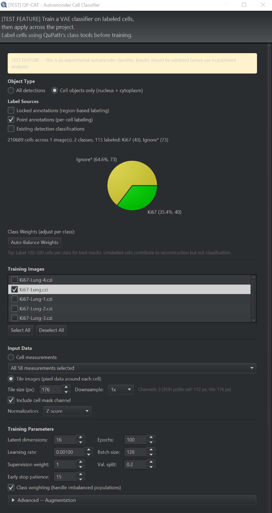

# Autoencoder cell classifier

Classifying cells by **appearance** rather than by measured marker values. Use it when
what separates your cell types is visual -- texture, shape, chromatin pattern -- and no
measurement in the table captures it. When a marker panel does capture it,
[clustering](clustering.md) is simpler, faster and easier to justify.

## When to use it

### When to Use

- **Measurement mode**: When marker expression patterns distinguish cell types. Fast, works on CPU. Start here.
- **Tile mode**: When morphology or spatial texture matters (e.g., differentiating activated vs resting T cells by size/shape). Slower, benefits from GPU.
- **vs Clustering**: Use the autoencoder when you have labeled examples and want to propagate labels. Use clustering when exploring unlabeled data.
- **vs Clustering**: Use the autoencoder when you have labeled training data and want a supervised classifier. Use clustering when you have no labels and want to discover populations.

### Labeling Strategy

- Label 100-200 cells per class for reliable results
- Use locked annotations for region-based labeling (efficient for many cells)
- Use point annotations for precise per-cell labeling
- Include "Unclassified" as a class if you want the model to learn what "none of the above" looks like
- Label across multiple images for better generalization

### Training Tips

- Start with measurement mode (faster iteration)
- Use the default hyperparameters initially -- they follow VAE best practices
- Monitor validation accuracy in the log -- if it plateaus early, try more latent dimensions
- If accuracy is low, add more labeled cells before tuning hyperparameters
- Use the Evaluate button to check performance before applying destructively
- Save the model before applying so you can reload if results are unsatisfactory

### Tile Mode Tips

- Use downsample 2x-4x for large tile sizes (saves memory, preserves most features)
- The cell mask channel (default ON) helps the model focus on the target cell
- All image channels are included automatically
- **Hybrid input**: Select morphology measurements (Solidity, Area, Circularity) alongside tiles to give the model quantitative shape features that complement pixel data. This is especially useful when cell shape is discriminative but hard for the convnet to learn from pixels alone (e.g., elongated fibroblasts vs round lymphocytes).

### Class Weights

- Use **Auto-Balance** when class populations are significantly imbalanced (e.g., 10:1 ratio or worse). This computes inverse-frequency weights so rare classes contribute equally to the loss.
- Manually adjust per-class weight spinners when you want to prioritize accuracy on specific classes -- increase the weight for classes where misclassification is most costly.
- If all classes are roughly equally represented, the default weight of 1.0 for each class is fine and Auto-Balance is unnecessary.

---
## Running it

Train a VAE-based classifier on labeled cells, then apply across the project.

> **Status.** Tested and working. Two things to know before you build on it:
> it is an **original QP-CAT implementation**, not a wrapper around a published
> Python library -- the VAE, the semi-supervised classifier head, the KL
> annealing schedule and the tile-mode masking were written for this extension.
> And it is **unpublished and not peer reviewed**. The design draws on published
> methods (see [REFERENCES.md](references.md#autoencoder-cell-classification)),
> but this particular combination has not been through review. Validate it on
> your own data before relying on it, and describe it as software rather than
> citing it as a method.

### Training

1. **Label cells** using any combination of these methods (100-200 per cell type recommended):
   - **Locked annotations** (default ON): Draw an annotation around a group of cells, assign a class (e.g., "Tumor"), then lock it (right-click > Lock). All detections inside inherit the class. Efficient for labeling many cells at once.
   - **Point annotations** (default ON): Select the Points tool, choose a class, click on individual cells. Each point labels the nearest detection within 50 pixels. Precise for single-cell labeling.
   - **Detection classifications** (default OFF): If detections already have PathClass labels from another tool. Cluster labels ("Cluster 0", etc.) are always ignored.
2. **Extensions > QP-CAT > Classify cells > Classify cells by appearance (deep learning)...**
3. **Select training images**: Choose one or more project images. Multi-image training produces more robust classifiers. The current image is pre-selected.
4. **Choose input mode:**
   - **Measurements** (default, recommended): Select measurements to use (typically "Mean" channel intensities). Fast, CPU-friendly.
   - **Tile images**: Uses pixel data around each cell. Captures morphology and texture. Choose tile size (32x32 recommended). Slower, benefits from GPU.
   - **Hybrid (Tile + Measurements)**: When tile mode is selected, you can also select measurements in the measurement panel. The model uses a Hybrid ConvVAE that concatenates convolutional tile features with the selected measurements (e.g., Solidity, Area, Circularity, or channel intensities) before the latent space. This combines spatial/morphological pixel information with quantitative cell-level features.
5. **Cell mask channel** (tile mode only, default ON): Appends a binary mask of the cell's outline as an extra channel. This tells the network which cell is the target while preserving neighbor context. Based on CellSighter (Amitay et al. 2023, Nature Communications).
6. **Configure class weights:**
   - **Per-class weight spinners**: Individual weight spinners appear for each detected class. Adjust to emphasize or de-emphasize specific cell types during training.
   - **Auto-Balance Weights** button: Click to automatically compute inverse-frequency weights based on the number of labeled cells per class. This is recommended when class populations are imbalanced (e.g., 5000 tumor cells but only 200 rare immune cells).
7. **Adjust training parameters** if desired (defaults work well for most cases):
   - Latent dimensions: 16 (how compressed the representation is; 8-32 typical)
   - Epochs: 100 (maximum training iterations; early stopping may stop sooner)
   - Supervision weight: 1.0 (how strongly labels influence the model; 0 = unsupervised)
   - Learning rate: 0.001 (ReduceLROnPlateau scheduler adjusts this automatically)
   - Batch size: 128 (reduce for tile mode if out of memory)
   - Validation split: 0.2 (20% holdout for early stopping and best model selection)
   - Early stop patience: 15 (epochs without val improvement before stopping; 0 = disabled)
   - Class weighting: ON (handles imbalanced cell populations via inverse-frequency weights)
   - Data augmentation: expand the collapsible **Advanced -- Augmentation** section to configure augmentation options (Gaussian noise + per-channel scaling for measurement mode). The section is collapsed by default to reduce dialog clutter.
8. Click **Train on Selected Images**
9. Review accuracy on labeled cells in the status bar

### Applying to Project

After training on the current image:

1. Click **Apply to Checked Images**
2. The trained model encodes each image's cells and assigns predicted labels
3. For tile mode, tiles are read from each image's server automatically
4. Results (labels + latent features + confidence) are saved per image

### Outputs

Each detection receives:
- `AE_0` through `AE_N` measurements: learned latent features (N = latent dimensions)
- `AE_confidence`: prediction confidence (0.0-1.0, higher = more certain)
- PathClass label: predicted cell type (only if labeled cells were provided)

The latent features (AE_*) can be used as input for clustering (select them as measurements in the clustering dialog) or visualized via UMAP.

### Persistent Settings

All dialog settings (input mode, tile size, hyperparameters, label sources, augmentation, etc.) are saved between QuPath sessions. The next time you open the dialog, your previous settings are restored.

### Performance Notes

- **Measurement mode**: Trains in seconds to minutes on CPU. GPU provides minimal benefit.
- **Tile mode (32x32)**: ~2-5 min for 1k cells on CPU, ~20-60 min for 10k cells. GPU recommended.
- **Tile mode (64x64)**: Significantly slower. GPU strongly recommended. Reduce batch size if memory errors occur.
- **Inference** (applying to project): Much faster than training -- typically seconds per image.
- **Memory**: Tile mode with 40+ channels and 64x64 tiles can require several GB of GPU memory.

### Tips

- More labeled cells = better accuracy. Aim for 100+ per class.
- If accuracy is low, try: increasing epochs, increasing latent dimensions, or adding more labeled cells.
- For tile mode, start with 32x32 tiles. Only increase if the model underperforms.
- The measurement mode is usually sufficient for marker-based phenotyping. Use tile mode when morphology or spatial texture matters.
- Run on a well-annotated image first, validate by visual inspection, then apply to the project.
- Low AE_confidence scores highlight uncertain predictions -- review these cells manually.

---
